# Webpack简单入个门

`个人学习笔记`

### 特点
* 一致且开放：
  + 一致性，可以忽略资源之间的差异：
    - 所有资源都是 Module；
    - 借助Loader，Webpack几乎可以处理任意类型资源；
  + 开放性：
    - 可以轻松接入TS、Babel等JS编译工具；Less、Sass等CSS预处理器；

### 理解
`Webpack打包流程大致可以划分：输入 -> 模块处理 -> 后处理 -> 输出`

### 流程
* 输入：从文件系统读入文件
* 模块处理：根据文件类型调用对应Loader，将结果转为AST，并分析依赖关系，进一步递归处理所有依赖文件
* 后处理：待所有模块处理完毕后执行，包括模块合并、注入运行时、产物优化。最终输出Chunk集合
* 输出：将Chunk写出到外部文件系统

##### 流程相关配置项
* 输入输出：
  + entry：定义项目入口文件
  + context：项目执行上下文路径
  + output：配置产物输出路径、名称等
* 模块处理：
  + resolve：配置模块路径解析规则
  + module：配置模块加载规则
  + externals：声明外部资源，Webpack会忽略这部分资源，跳过这些资源的解析和打包工作
* 后处理：
  + optimization：优化产物包体积
  + target：配置目标产物的目标运行环境
  + mode：声明环境
* 其他提效工具：
  + 开发效率：
    - watch：持续监听文件变化，持续构建
    - devtool：配置Sourcemap生成规则
    - devServer：配置HMR相关
  + 性能优化：
    - cache：缓存编译信息和编译结果
    - performance：配置产物超过阈值，如何告知开发者
  + 日志类：
    - stats：精确控制编译过程的日志内容
    - infrastructureLogging：控制日志输出方式

### 常用工具
* Babel

```javascript
  // webpack.config.js
  module.exports = {
    modules: {
      rules: [
        {
          test: /\.js$/,
          use: {
            loader: 'babel-loader',
            options: {
              presets: ['@babel/preset-env']
            }
          }
        }
      ]
    }
  };
```

* TS

```javascript
  // webpack.config.js
  module.exports = {
    modules: {
      rules: [
        {
          test: /\.ts$/,
          use: ['ts-loader']
        }
      ]
    },
    resolve: {
      extensions: ['.ts', '.js']
    }
  }
```

* ESLint

```javascript
  // .eslintrc
  {
    "extends": "standard"
  }
```

```javascript
  // webpack.config.js
  const path = require('path');
  const ESLintPlugin = require('eslint-webpack-plugin');

  module.exports = {
    entry: './src/index',
    mode: 'develop',
    output: {
      filename: '[name].[contenthash].js',
      path: path.join(__dirname, 'dist')
    },
    plugins: [new ESLintPlugin({ extensions: ['.js', '.ts'] })]
  }
```

* css
  + css-loader：解析css内容
  + style-loader：将css内容注入到页面`<style>`标签内
  + mini-css-extract-plugin：将css代码单独抽离成`.css`文件，通过`<link>`标签插入到页面
  
```javascript
  // webpack.config.js
  const HTMLWebpackPlugin = require('html-webpack-plugin');
  const MiniCssExtractPlugin = require('mini-css-extract-plugin');

  module.exports = {
    modules: {
      rules: [
        {
          test: /\.css$/i,
          use: [
            process.env.NODE_ENV === 'develop' ? 'style-loader' : MiniCssExtractPlugin.loader,
            "css-loader",
            {
              loader: 'postcss-loader',
              options: {
                postcssOptions: {
                  plugins: [require('autoprefixer')]
                }
              }
            }
          ]
        }
      ]
    },
    plugins: [
      new MiniCssExtractPlugin(),
      new HTMLWebpackPlugin()
    ]
  }
```

* img
  + file-loader：将图像引用转为url语句并生成相应图片文件
  + url-loader：设定阈值`limit`，对于小于阈值图片直接转为`base64编码`；大于阈值的图片则调用file-loader加载

```javascript
  // webpack.config.js
  module.exports = {
    module: {
      rule: [{
        test: /\.(png|jpg|jpeg)$/,
        use: [{
          loader: 'url-loader',
          options: {
            limit: 1024
          }
        }]
      }]
    }
  }
```

### 核心流程细解
* 初始化阶段：
  + 初始化参数：从配置文件、配置对象、shell参数中读取，与默认配置结合得出最终配置
  + 创建编译器对象：用参数创建`Compiler`对象
  + 初始化编译环境：注入内置插件、注入模块工厂、初始化RuleSet集合、加载配置的插件等
  + 开始编译：执行`Compiler`对象的run方法，创建`Compilation`对象
  + 确定入口：根据配置的`entry`找出所有的入口文件，调用`compilation.addEntry`将入口文件转换为`dependence`对象
* 构建阶段：
  + 编译模块(make)：从`entry`文件开始，调用对应`loader`将模块转为标准JS内容，调用JS解析器将内容转为AST对象，从中找出该模块的依赖模块，再递归处理依赖模块，直到所有入口依赖的文件都经过编译处理完毕
  + 完成模块编译：得到上一步完成后所有被依赖模块的编译内容和它们之间的依赖关系图
* 封装阶段：
  + 合并(seal)：根据入口和模块之间的依赖关系，组装成一个个包含多个模块的`Chunk`
  + 优化(optimization)：对`Chunk`做进一步优化，包括tree-shaking、terser、压缩等
  + 写入文件系统(emitAssets)：根据配置确定输出的路径和文件名，把文件内容写入到文件系统

### 性能
* 可能引起的性能问题：
  + 构建阶段
    - 需要将文件的相对引用路径转为绝对路径，这个过程可能涉及多次IO操作，执行效率取决于文件`层次深度`
    - 找到具体文件后，需要读入文件内容并调用`LoaderRunner`遍历Loader数组完成内容编译，这个过程需要执行密集CPU操作，执行效率取决于`Loader的数量与复杂度`
    - 需要将标准JS内容转为AST，并遍历AST找出模块的依赖资源，这个过程层需要执行密集CPU操作，执行效率取决于`代码复杂度`
    - 递归处理依赖资源，执行效率取决于`模块数量`
  + 封装阶段：
    - 根据`splitChunks`配置、`entry`配置，动态模块引用语句等，确定模块与Chunk映射关系，其中`splitChunks`相关的分包算法非常复杂，涉及大量CPU计算
    - 根据`optimization`配置执行一系列产物优化操作，其中诸如`Terser`插件需要执行大量AST相关计算，执行效率取决于`产物代码量`
* 性能分析-如何收集、分析Webpack打包过程的性能数据：
  + 数据收集
    - 添加`profile: true`配置
    ```javascript
      // webpack.config.js
      module.exports = {
        // ...
        profile: true
      }
    ```
    - 运行编译命令，并添加`--json`参数，参数值为最终生成的统计文件名
    ```javascript
      // shell
      npx webpack --json=stats.json
    ```
  + `stats`对象收集了Webpack打包过程中许多信息
    - `modules`：本次打包处理的所有模块列表，内容包含模块大小、所属`Chunk`、构建原因、依赖模块等。`modules.profile`属性，包含了构建该模块时，解析路径、编译、打包、子模块打包等各个环节花费的时间
    - `chunks`：构建过程的`chunks`列表，数组包含`chunk`名称、大小、包含模块等
    - `assets`：编译后最终输出的产物列表、文件路径、文件大小等
    - `entrypoints`：`entry`列表
    - `children`：子`Compiler`对象的性能数据，例如`extract-css-chunk-plugin`插件内部就会创建子`Compiler`来做CSS抽取工作
    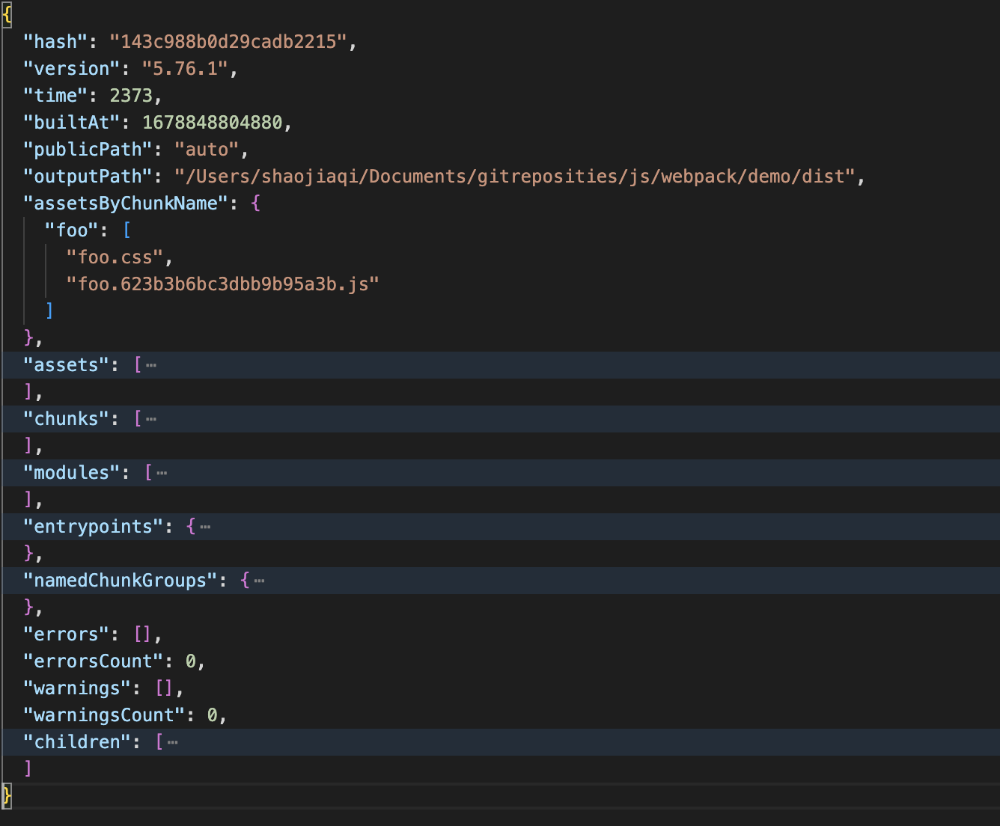
  + 可视化分析
    - Webpack Analysis<br />
      webpack官方提供的可视化分析工具，只需将`stats.json`文件导入页面，就可以看到分析
    - Statoscope<br />
      安装
      ```shell
        // install
        npm i -D @statoscope/webpack-plugin
      ```
      注册插件
      ```javascript
        // webpack.config.js
        const StatoscopeWebpackPlugin = require('@statoscope/webpack-plugin').default;
        
        module.exports = {
          // ...
          plugins: [new StatoscopeWebpackPlugin()]
        }
      ```
      运行`npx webpack`命令，编译结束默认打开编译分析视图
      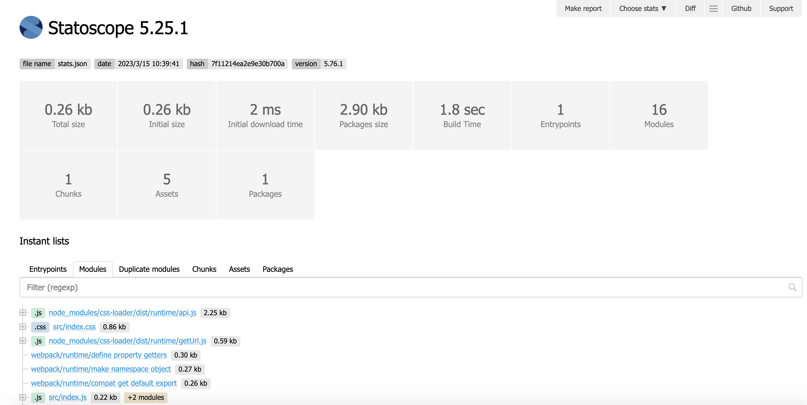

##### 持久化缓存
* 持久化缓存-webpack5新特性<br />
  将首次构建的过程与结果数据持久化保存到本地文件系统，在下次构建时跳过解析、链接、编译等一系列耗时操作，直接复用上次的Module/ModuleGraph/Chunk对象数据，迅速构建出最终产物。
  + cache配置
    - type：缓存类型，支持`'memory' | 'filesystem'`，设置为`'filesystem'`开启持久缓存
    - cacheDirectory：缓存文件路径，默认为`nodule_modules/.cache/webpack`
    - buildDependencies：额外依赖文件，当这些文件内容变化，缓存会失效而执行完成编译构建，一般设置为各种配置文件
      ```javascript
        // webpack.config.js
        module.exports = {
          // ...
          cache: {
            type: 'filesystem',
            buildDependencies: {
              config: [
                path.join(__dirname, '.babelrc')
              ]
            }
          }
        }
      ```
    - managedPaths：受控目录，Webpack构建时会跳过新旧代码哈希值与时间戳对比，直接使用缓存副本，默认值为`[./node_modules]`
    - profile：是否输出缓存过程详细日志，默认`false`
    - maxAge：缓存失效时间，默认`5184000000`，即`60天`
  + 原理<br />
    Webpack的构建过程，大致可分为三个阶段，初始化、构建阶段、生成阶段。<br />
    构建阶段包括：读入文件、执行loader链、解析AST、解析依赖。<br />
    生成阶段包括：代码转译、收集运行时依赖、生成chunk、产物优化。<br />
    这个过程中存在许多CPU密集型操作，例如调用Loader链加载文件，遇到babel-loader、eslint-loader、ts-loader等工具时可能需要重复生成AST；分析模块依赖时需要遍历AST，执行大量计算。<br />
    而Webpack5的持久化缓存功能则是将构建结果保存到文件系统中，在下一次编译时比对每个文件的内容哈希或时间戳，未发生变化的文件则跳过编译操作，直接使用缓存副本。
  + Webpack4可以使用`cache-loader`（只缓存Loader执行结果），`hard-source-webpack-plugin`（效果与Webpack5自带的Cache对齐）

##### 并行构建
* 并行构建
  + HappyPack（作者不维护）<br />
    HappyPack能将文件加载（Loader）操作拆到多个子进程中并发进行，子进程执行完毕再将结果返回到主进程，从而提升构建性能。<br />
    - 使用<br />
      * 安装
        ```shell
          npm i -D happypack
        ```
      * 配置<br />
        使用`happypack/loader`替代原本的Loader序列<br />
        使用`HappyPackPlugin`注入代理执行Loader序列的逻辑
          ```javascript
            const os = require('os');
            const HappyPack = require('happypack');
            const happyThreadPool = HappyPack.ThreadPool({
              // 设置进程池大小
              size: os.cpus().length - 1,
            });

            module.exports = {
              // ...
              modules: {
                rules: [{
                  test: /\.js$/,
                  use: 'happypack/loader?id=js'
                }, {
                  test: /\.css$/,
                  use: 'happypack/loader?id=styles'
                }]
              },
              plugins: [
                new HappyPack({
                  id: 'js',
                  loaders: ['babel-loader', 'eslint-loader'],
                }),
                new HappyPack({
                  id: 'styles',
                  loaders: ['style-loader', 'css-loader']
                })
              ]
            }
          ```
  + Thread-loader<br />
    与HappyPack功能类似，但是由Webpack官方维护
    - 使用<br />
      * 安装
        ```shell
          npm i -D thread-loader
        ```
      * 配置<br />
        将`thread-loader`放在`use`数组首位，确保最先运行
        ```javascript
          module.exports = {
            // ...
            module: {
              rules: [{
                test: /\.js$/,
                use: ['thread-loader', 'babel-loader', 'eslint-loader']
              }]
            }
          }
        ```
    - 缺点<br />
      * 在Thread-loader中运行的Loader不能调用emitAsset等接口，这会导致`style-loader`这类加载器无法正常工作，解决方法是将这类Loader放在`thread-loader`之前，例如`['style-loader', 'thread-loader', 'css-loader']`
      * Loader中无法获取`compilation`、`compiler`等实例对象，也无法获取Webpack配置
* 并行压缩<br />
  Webpack4默认使用`Uglify-js`实现代码压缩，Webpack5使用`Terser`——一种性能更好与兼容性更好的JS代码压缩混淆工具。
  + Terser
    ```javascript
      const TerserPlugin = require('terser-webpack-plugin');

      module.exports = {
        // ...
        // Webpack5 默认开启
        optimization: {
          minimize: true,
          minimizer: [new TerserPlugin()]
        }
      }
    ```
* 总结<br />
  并行确实能提升系统运行效率，但Node单线程架构下，所有并行计算都依托于派生子进程执行，而创建进程这个动作开销就很大——约`600ms`，所以上述并行方案需要根据项目大小按需使用。

##### 构建优化
* `lazyCompilation`

  实验性特性，用于实现`entry`或异步模块的按需编译。
  ```javascript
    // webpack.config.js
    module.exports = {
      // ...
      experiments: {
        lazyCompilation: true
      }
    }
  ```
  启用`lazyCompilation`后，代码中通过异步语句导入的模块以及未被访问到的`entry`都不会立即编译，而是页面正式请求该模块资源时才开始构建，可以极大提升冷启动速度。<br />
  尚在试验阶段，建议开发环境使用。
* 约束Loader执行范围

  Loader在执行过程中需要密集CPU操作，为此可以使用`module.rules.include`、`module.rules.exclude`等配置项，限定Loader执行范围（通常可以排除`node_modules`文件夹）。
  ```javascript
    // webpack.config.js
    module.exports = {
      // ...
      module: {
        rules: [{
          test: /\.js$/,
          exclude: /node_modules/,
          use: ['babel-loader', 'eslint-loader']
        }]
      }
    }
  ```
  配置`exclude: /node_modules/`属性后，Webpack在处理`node_modules`中的文件时会直接跳过这个`rule`项。<br />
  此外`include`与`exclude`支持通过`and/not/or`属性配置组合过滤逻辑：
  ```javascript
    // webpack.config.js
    module.exports = {
      // ...
      module: {
        rules: [{
          test: /\.js$/,
          exclude: {
            and: [/node_modules/],
            not: [/node_modules\/lodash/]
          },
          use: ['babel-loader', 'eslint-loader']
        }]
      }
    }
  ```
  通过这种能力，可以将部分需要转译处理的NPM包（例如代码中包含ES6语法），纳入Loader处理范围。
* 使用`noParse`跳过文件编译

  很多库已经做好打包处理，不需要二次编译即可在浏览器运行，例如Vue2的`node_modules/vue/dist/vue.runtime.esm.js`、Lodash的`node_modules/lodash/lodash.js`<br />
  这些文件作为独立、内聚的模块，可以使用`module.noParse`配置项跳过：
  ```javascript
    // webpack.config.js
    module.exports = {
      // ...
      module: {
        noParse: /lodash|react/
      }
    }
  ```
  配置后，所有命中该配置项的文件都会跳过前置的构建、分析动作，内容被直接合并进`Chunk`。<br />
  同时要注意：
    + 命中`noParse`配置项的文件不能存在对其它文件的依赖，除非运行环境支持用到的模块化导入方案
    + 由于跳过内容分析过程，Webpack无法标记该文件的导出值，即无法实现`Tree-shaking`
* 开发模式禁用产物优化
  ```javascript
    // webpack.config.js
    module.exports = {
      // ...
      mode: 'development',
      optimization: {
        removeAvailableModules: false, // 如果当前模块已经包含在父级模块，Webpack从chunk中检测出这些模块并移除
        removeEmptyChunks: false, // 如果chunk为空，Webpack检测并移除这些chunk
        splitChunks: false, // 关闭代码分包
        minimize: false, // 关闭代码压缩
        concatenateModules: false, // 关闭模块合并
        usedExports: false, // 关闭Tree-shaking
      }
    }
  ```
* 最小化`watch`监听范围

  在`watch`模式下（`npx webpack --watch`），Webpack会持续监听项目目录下所有代码文件，发生变化时执行`rebuild`命令。<br />
  通常，部分资源不会频繁更新，例如`node_modules`，此时可通过`watchOptions.ignored`配置项忽略这些文件：
  ```javascript
    // webpack.config.js
    module.exports = {
      // ...
      watchOptions: {
        ignored: /node_modules/
      }
    }
  ```
* 优化`eslint`性能

  在开发模式下使用`eslint`实时代码检查，会带来比较高昂且不必要的性能成本，可以使用`eslint-webpack-plugin`替代。<br />
  `eslint-webpack-plugin`会在模块构建完毕（`compilation.hooks.succeedModule`钩子)后执行检查，不会阻塞文件加载流程。
  + 安装
    ```shell
      npm i -D eslint-webpack-plugin
    ```
  + 使用
    ```javascript
    const ESLintPlugin = require('eslint-webpack-plugin');
    
    module.exports = {
      // ...
      plugins: [new ESLintPlugin(options)]
    }
    ```
  + 其他
    - 可以使用编辑器自带插件完成ESLint检查
    - 使用`husky`，在代码提交前执行ESLint检查

##### 动态加载

  Webpack默认会将同一`Entry`下所有模块打包成一个产物文件，包括与页面关键渲染路径无关的代码，这会导致页面初始化需要花费更多时间下载这部分代码，影响首屏渲染性能。
  * 动态加载是Webpack内置能力：
  ```javascript
    // index.js
    const content = await import('./modules/asyncModule')
  ```
  * 缺点
    + 过度使用会使产物过于细碎，产物文件过多可能影响HTTP性能
    + 使用时Webpack需要在Client端注入一段支持动态加载特性的Runtime，这段代码压缩后体积也在2.5KB左右
  * 通用方案
    社区比较常见的用法是配合SPA的前端路由能力实现页面级别的动态加载：
    ```javascript
      import { createRouter, createWebHashHistory } from "vue-router";

      const Home = () => import("./Home.vue");
      const Foo = () => import(/* webpackChunkName: "sub-pages" */ "./Foo.vue");
      const Bar = () => import(/* webpackChunkName: "sub-pages" */ "./Bar.vue");

      // 基础页面
      const routes = [
        { path: "/bar", name: "Bar", component: Bar },
        { path: "/foo", name: "Foo", component: Foo },
        { path: "/", name: "Home", component: Home },
      ];

      const router = createRouter({
        history: createWebHashHistory(),
        routes,
      });

      export default router;
    ```
    示例中，三个组件均通过动态加载导入，仅当页面切换到相应路由时才会加载对应代码。<br />
    同时`webpackChunkName`用于指定该异步模块的Chunk名称，相同Chunk名称的模块会打包到一起。

##### HTTP 缓存优化
  
  可以通过调整产物文件的名称与内容，使其更是配HTTP持久化缓存策略。
  > Hash 是一种将任意长度的消息压缩到某一固定长度的消息摘要的函数，不同明文计算出的摘要值不同，所以常常被用作内容唯一标识。
  * Webpack提供的常用Hash占位符：

    > 可以通过占位符传入Hash位数，如[contenthash:7]，即可限定生成的Hash长度。
    + `[fullhash]`：整个项目的内容Hash，项目中任意模块变化都会产生新的`fullhash`
    + `[chunkhash]`：产物对应Chunk的Hash，Chunk中任意模块变化都会产生新的`chunkhash`
    + `[contenthash]`：产物内容Hash，仅当产物内容发生变化产生新的`contenthash`，实用性高
  * 异步模块变化引发父级模块Hash同步变化<br />
    异步Chunk的路径变化导致了父级Chunk的内容变化，可以使用`optimization.runtimeChunk`将这部分代码抽取为单独的Runtime Chunk。

##### 使用外置依赖
  `externals`的主要作用是将部分模块排除在Webpack打包系统之外：
  ```javascript
    // webpack.config.js
    module.exports = {
      // ...
      externals: {
        lodash: 'lodash'
      }
    }
  ```
  启用上述配置后，Webpack会预设运行环境已内置相关库，不需要再将这些模块打包到产物中。
  使用

##### 使用 Tree-Shaking 删除多余模块导出
  > `Tree-Shaking`是基于`ES Module`规范的`Dead Code Elimination`技术，它会在运行过程中静态分析模块之间的导入导出，删除未使用的导出值。
  * 启用
    + 配置`optimization.useExports`为true，标记模块导入导出列表
    + 启动代码优化功能：
      - 配置`mode = production`
      - 配置`optimization.minimize = true`
      - 提供`optimization.minimizer`数组

##### 使用 Scope Hoisting 合并模块
  默认情况下，Webpack会将模块打包成一个个单独的模块：
  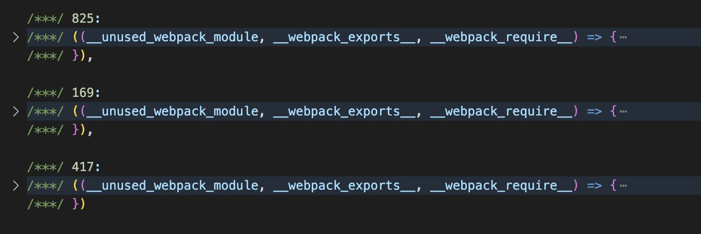
  这种方式需要将每个模块包裹进一段相似的函数模板中，增加了体积。<br />
  Webpack提供Scope Hoisting功能，用于将**符合条件的多个模块合并到同一个函数空间**中，从而减少产物体积。
  * Webpack提供了三种开启方法：
    + 配置`mode = production`
    + 配置`optimization.concatenateModules`
    + 使用`ModuleConcatenationPlugin`插件
  * 与Tree-Shaking类似，Scope Hoisting底层基于`ES Module`的静态特性，推断模块间依赖关系，并进一步判断模块能否合并，因此在以下场景会失效：
    - 非ESM模块
    - 模块被多个Chunk引用

##### 监控产物体积

  Webpack提供了一套性能监控方案，当构建产物体积超出阈值时抛出警告：
  ```javascript
    // webpack.config.js
    module.exports = {
      // ...
      performance: {
        // 设置所有产物体积阈值
        maxAssetSize: 172 * 1024,
        // 设置entry产物体积阈值
        maxEntrypointSize: 244 * 1024,
        // 报错方式，支持 `error` | `warning` | false
        hints: 'error',
        // 过滤需要监控的文件类型
        assetFilter(filename) {
          return filename.endsWith('.js');
        }
      }
    }
  ```


### Chunk
* 按官方文档，Chunk可以分为两种：
  + `initial` is the main chunk for the entry point. This chunk contains all the modules and their dependencies that you specify for an entry point.
  + `non-initial` is a chunk that may be lazy-loaded. It may appear when dynamic import or SplitChunksPlugin is being used.
* 具体规则：
  + 根据`entry`配置创建对应数量的Chunk
  + 遍历构建阶段找到的所有Module，同一Entry下的模块分配到Entry对应的Chunk中
  + 遍历到异步模块创建新的Chunk
  + 根据SplitChunksPlugin的配置继续对上述Chunk执行**裁剪、拆分、合并、代码调优**
  + 最终，将这些Chunk输出成最终的产物（Asset）文件
* 作用：
  + 一方面作为Module容器，根据默认的**分包策略**决定合并哪些模块打包。
  + 一方面根据`SplitChunks`设定的策略优化Chunk，决定最终输出产物。
* 默认分包策略：
  + 策略
    - Initial Chunk：entry模块及相应子模块打包成Initial Chunk。
    - Async Chunk：通过import('./xx').then()等语句导入的异步模块及相应子模块组成的Async Chunk。
    - Runtime Chunk：运行时代码抽离成Runtime Chunk，可通过`entry.runtime`配置项设置。
  + 问题<br />
    `Initial Chunk`和`Async Chunk`在默认规则下会带来两个比较明显的问题
    - 模块重复打包
      如果多个Chunk依赖同一个Module，那么这个Module会不受限制地重复打包进这些Chunk。<br />
      例如有两个`entry`同时依赖`c模块`，那么Webpack默认会把`c模块`同时打包进两个`entry`的Chunk。
    - 弊端<br />
      Webpack会将Entry模块、异步模块所有代码都单独打入一个单独的包，随着项目迭代，包体积的增长可能导致应用响应时间越来越长。这种打包方式存在两个弊端：
      * 资源冗余：客户端必须等应用所有代码加载完毕才能启动运行，但可能用户当前访问的页面只需要其中一部分代码。
      * 缓存失效：大部分资源打入同一个包中，任何改动都可能导致缓存失效。
  + 优化-更合理的分包策略
    - 将被多个Chunk依赖的包抽离成独立Chunk。
    - `node_modules`中资源变更通常较少，可以抽离成独立包，这样业务代码的变动并不会导致第三方库资源缓存失效。
* `SplitChunksPlugin`
  + 特点：
    - 支持Module路径、Module被引用次数、Chunk大小、Chunk请求数等决定是否对Chunk做进一步拆分，这些策略可通过`optimization.splitChunks`配置项调整，常用优化：
      * 单独打包特定路径的内容，例如`node_modules`打包为`vendors`
      * 单独打包使用频率高的文件
    - 利用`optimization.splitChunks.cacheGroup`配置项对不同特点的资源做分组处理，并为这些分组设置针对性分包规则
    - 内置了`default`与`defaultVendors`两个`cacheGroup`，提供一些开箱即用的分包特性：
      * `node_modules`资源会命中`defaultVendors`规则，并被单独打包
      * 只有包体积超过20kb的Chunk才会被单独打包
      * 加载`Async Chunk`所需请求数不得超过30
      * 加载`Initial Chunk`所需请求数不得超过30
  + 设置分包范围<br />
    `SplitChunksPlugin`默认只对`Async Chunk`生效，可以通过`splitChunks.chunks`调整作用范围：
    - `all`：对`Initial Chunk`与`Async Chunk`都生效，建议使用
    - `initial`：只对`Initial Chunk`生效
    - `async`：只对`Async Chunk`生效
    - 函数`(chunk) => boolean`：该函数返回`true`时生效
  + 根据Module使用频率分包<br />
    `SplitChunksPlugin`支持按Module被Chunk引用次数决定是否分包。
    - 配置
      ```javascript
      // webpack.config.js
      module.exports = {
        // ...
        entry: {
          entry1: './src/entry-a.js',
          entry2: './src/entry-b.js'
        },
        optimization: {
          splitChunks: {
            // 引用次数大于等于2的模块分包
            minChunks: 2
          }
        }
      }
      ```
    - 例如对如下配置
      ```javascript
        // webpack.config.js
        module.exports = {
          // ...
          optimization: {
            splitChunks: {
              minChunks: 2
            }
          }
        }

        // module.js
        export default 'module';

        // async-module.js
        export module from './module.js';

        // entry-a.js
        import module from './module';
        import('./async-module');

        // entry-b.js
        import module from './module';
      ```
      针对上述配置，`entry-a`，`entry-b`视作`Initial Chunk`处理；`async-module`被`entry-a`异步方式引入，视作`Async Chunk`处理。对`module`模块来说，被引用数为3，因此该模块会被单独分包。最终产物（不考虑其他配置项条件）：
      * entry1.js
      * entry2.js
      * async-module.js
      * module.js
  + 限制分包数量<br />
    在`minChunks`基础上，为防止最终产物文件数量过多导致HTTP网络请求剧增，反而降低应用性能，Webpack提供`maxInitialRequest/maxAsyncRequest`配置项，用于限制分包数量：
    > “请求数”：指加载一个Chunk时所需加载的所有分包数。
    - `maxInitialRequest`：入口点的最大并行请求数
    - `maxAsyncRequest`：按需加载时的最大并行请求数
    - 入口点的最大并行请求数计算逻辑：
      * `Initial Chunk`算作一个请求
      * `Async Chunk`不算做一个并行请求
      * 通过`runtimeChunk`拆分出的runtime不算并行请求
      * 如果同时有两个Chunk满足拆分规则，但是`maxInitialRequest`或`maxAsyncRequest`的值只能再拆一个模块，那么体积更大的模块会被拆解
  + 更多配置项<br />
    除了上述根据模块使用频率和包数量这两个条件，Webpack还提供了一系列与Chunk有关分包判断规则，借助这些规则可以实现当包体积过小直接取消分包——防止产物过碎；当包体积过大时尝试对Chunk再做拆解——防止单个Chunk过大。相关配置项：
    - `minSize`：超过这个尺寸的Chunk才会被正式分包
    - `maxSize`：超过这个尺寸的Chunk会尝试进一步拆分出更小的Chunk
    - `maxAsyncSize`： 与`maxSize`相似，只对异步引入的模块生效
    - `maxInitialSize`：与`maxSize`相似，只对`entry`配置的模块生效
    - `enforceSizeThreshold`：超过这个尺寸的Chunk会被强制分包，忽略上述Size限制
  + `SplitChunksPlugin`工作流程
    - `SplitChunkPlugin`尝试将命中`minChunks`规则的Module统一抽到一个额外的Chunk对象；
    - 判断该Chunk是否满足`maxInitialRequests`阈值，若满足进行下一步：
    - 判断该Chunk的体积是和`minSize`配置项：
      * 如果体积小于`minSize`取消此次分包，对应Module依然并入原来的Chunk；
      * 如果Chunk体积大于`minSize`，则判断是否超过`maxSize`、`maxAsyncSize`、`maxInitialSize`声明的阈值，如果超过尝试将该Chunk继续分割成更小的部分；
  + 合理分包
    > 虽然`maxSize`等阈值规则会产生更多的包体，但缓存粒度会更小，命中率相对会更高，配和持久化缓存和HTTP2的多路复用能力，网络性能反而会有正向收益。
  + `cacheGroups`<br />
    上述`minChunks`、`maxInitialRequest`、`minSize`都属于分包条件；`splitChunksPlugin`还提供了`cacheGroups`配置项对不同文件组设置不同规则：
      ```javascript
        // webpack.config.js
        module.exports = {
          // ...
          optimization: {
            splitChunks: {
              cacheGroups: {
                vendors: {
                  test: /[\\/]node_modules[\\/]/,
                  minChunks: 1,
                  minSize: 0
                }
              }
            }
          }
        }
      ```
    通过设置`cacheGroups`配置`vendors`缓存组，所有命中`vendors.test`规则的模块都会被归类为`vendors`分组，优先使用该分组下`minChunks`、`minSize`等分包配置。
    > 缓存组可以继承和/或覆盖来自`splitChunks.*`的任何选项。但是`test`、`priority`和`reuseExistingChunk`只能在缓存组级别上进行配置。将它们设置为false以禁用任何默认缓存组。

    缓存组能为不同类型的资源设置更合适的分包规则，一个典型场景是将所有`node_modules`下的模块打包到vendors产物，从而实现第三方库与业务代码分离。
    - 配置项
      * 支持`minSize/minChunks/maxInitialRequest`等配置项
      * `test`：支持正则、函数及字符串，所有符合`test`判断的`Module`或`Chunk`都会分到该组
      * `type`：支持正则、函数及字符串，与`test`类似用于筛选分组命中的模块，区别是`type`的判断依据是文件类型，例如`type='json'`会命中所有JSON文件
      * `name`：支持字符串、函数，用于设置拆分Chunk的名称
      * `priority`：数字，用于设置分组优先级，若模块命中多个缓存分组，优先被分到`priority`更大的组
    
    Webpack提供了两个开箱即用的`cacheGroups`，分别是`default`与`defaultVendors`
      ```javascript
        // webpack.config.js
        module.exports = {
          // ...
          optimization: {
            splitChunks: {
              cacheGroups: {
                default: {
                  name: '',
                  reuseExistingChunk: true,
                  minChunks: 2,
                  priority: -20
                }
              },
              defaultVendors: {
                name: 'vendors',
                reuseExistingChunk: true,
                test: /[\\/]node_modules[\\/]/i,
                priority: -10
              }
            }
          }
        }
      ```
    这两配置项默认做的事：
      * 将所有`node_modules`中的资源单独打包到`vendors-xxx-xxx.js`命中的产物
      * 引用次数不小于2的模块，单独打包
  + 最佳策略
    - `node_modules`：
      * 可以将`node_modules`资源打包成单独文件（通过`cacheGroups`），防止业务代码的变更影响NPM包的缓存，同时建议设置`maxSize`
    - 业务：
      * 设置`common`分组，通过`minChunks`配置项将使用频率较高的资源合并为Common资源
      * 首屏用不上的代码，尽量以异步方式引入
      * 设置`optimization.runtimeChunk`为true，将运行时代码拆分为独立资源

### 压缩
* [TerserWebpackPlugin](https://webpack.docschina.org/plugins/terser-webpack-plugin)

  Webpack5后默认使用Terser作为JS代码压缩器，仅需启用`optimization.minimize`配置项即可。

  > `mode='product'`，默认会开启Terser压缩
    ```javascript
      // webpack.config.js
      module.exports = {
        // ...
        optimization: {
          minimize: true
        }
      }
    ```
  + [Terser配置项](https://github.com/terser/terser#compress-options)
    - `dead_code`：默认true，是否删除不可触达代码
    - `booleans_as_integers`：默认false，是否将Boolean转换为0、1
    - `join_vars`：默认true，是否合并连续声明，例如`var a = 1; var b = 2;`合并为`var a = 1, b = 2;`
    - 等等
  + [TerserWebpackPlugin配置项](https://webpack.docschina.org/plugins/terser-webpack-plugin/#options)

    > 如果希望自定义配置，那么仍需安装`terser-webpack-plugin`。
    - `test`：匹配要压缩的文件
    - `include`：在该范围内的产物会压缩
    - `exclude`：不在该范围内的产物会压缩
    - `parallel`：默认true，启用并行压缩
    - `minify`：配置自定义压缩函数，默认使用`terser`库
    - `terserOptions`：`Terser`的`minify`选项
    - `extractComments`：默认true，注释是否提取到一个单独文件中
  + 针对不同产物执行不同压缩策略
    ```javascript
      // webpack.config.js
      module.exports = {
        entry: {
          foo: './src/foo.js',
          bar: './src/bar.js'
        },
        output: {
          filename: '[name].[contenthash].js',
          path: path.join(__dirname, 'dist')
        },
        optimization: {
          minimize: true,
          minimizer: [
            // 保留注释
            new TerserPlugin({
              test: /foo\.js$/i,
              terserOptions: {
                format: {
                  comments: /@license/i
                }
              },
              extractComments: 'all'
            }),
            // 删除注释
            new TerserPlugin({
              test: /bar\.js$/i,
              terserOptions: {
                format: {
                  comments: false
                }
              },
              extractComments: false
            })
          ]
        }
      }
    ```
  + TerserWebpackPlugin底层还支持使用UglifyJS、ESBUILD、SWC作为压缩器，使用时通过`minify`参数切换即可
    ```javascript
      // webpack.config.js
      module.exports = {
        // ...
        optimization: {
          minimize: true,
          minimizer: [
            new TerserPlugin({
              // `terserOptions` options will be passed to `uglify-js`
              minify: TerserPlugin.uglifyJsMinify,
              // minify: TerserPlugin.swcMinify,
              // minify: TerserPlugin.esbuildMinify,
            })
          ] 
        }
      }
    ```
* [CssMinimizerWebpackPlugin](https://webpack.docschina.org/plugins/css-minimizer-webpack-plugin/)
  > 这个插件使用 `cssnano` 优化和压缩 CSS
  + 安装
    ```shell
      npm i -D css-minimizer-webpack-plugin
    ```
  + 配置
    ```javascript
      // webpack.config.js
      const CssMinimizerPlugin = require('css-minimizer-webpack-plugin');
      const MiniCssExtractPlugin = require('mini-css-extract-plugin');

      module.exports = {
        // ...
        module: {
          rules: [{
            test: /\.css$/i,
            use: [MiniCssExtractPlugin.loader, 'css-loader']
          }]
        },
        optimization: {
          minimize: true,
          minimizer: [
            // Webpack5 之后，约定使用 `'...'` 字面量保留默认 `minimizer` 配置
            '...',
            new CssMinimizerPlugin()
          ]
        },
        // 需要使用 `mini-css-extract-plugin` 将 CSS 代码抽取为单独文件
        // 才能命中 `css-minimizer-webpack-plugin` 默认的 `test` 规则
        plugins: [new MiniCssExtractPlugin()]
      }
    ```
* [HtmlMinimizerWebpackPlugin](https://webpack.docschina.org/plugins/html-minimizer-webpack-plugin/)
  + 安装
    ```shell
      npm i -D html-minimizer-webpack-plugin
    ```
  + 配置
    ```javascript
      // webpack.config.js
      const HtmlMinimizerPlugin = require('html-minimizer-webpack-plugin');

      module.exports = {
        // ...
        optimization: {
          minimize: true,
          minimizer: [
            '...',
            new HtmlMinimizerPlugin({
              minimizerOptions: {
                // 折叠 Boolean 型属性
                collapseBooleanAttributes: true,
                // 使用精简 `doctype` 定义
                useShortDoctype: true
              }
            })
          ]
        }
      }
    ```
    > 更多minimizerOptions配置项 [Html-minifier-terser optimizations](https://github.com/terser/html-minifier-terser#options-quick-reference)

### Loader
  > loader 用于对模块的源代码进行转换。loader 可以使你在 import 或 "load(加载)" 模块时预处理文件。因此，loader 类似于其他构建工具中“任务(task)”，并提供了处理前端构建步骤的得力方式。loader 可以将文件从不同的语言（如 TypeScript）转换为 JavaScript 或将内联图像转换为 data URL。loader 甚至允许你直接在 JavaScript 模块中 import CSS 文件！

  Loader将文件中‘读’与‘处理‘的逻辑解耦，Webpack内部只需实现对标准JS代码解析/处理能力，特定资源的解析逻辑交由Loader补充。<br />
  Loader通常是一种mapping形式函数，接收原始代码，返回翻译结果：
  ```javascript
    module.exports = function (source) {
      const modifySource = doSomeThing(source);
      return modifySource;
    }
  ```
  * 工作流程：Webpack进入构建阶段，首先通过IO接口读取文件内容，之后调用LoaderRunner并将文件内容以`source`参数形式传递到Loader数组，`source`数据在Loader数组内可能会经过若干次形态转换，最终以标准JS代码提交给Webpack主流程，以此实现翻译功能。
  * 函数签名：
    ```javascript
      module.exports = function (source, sourceMap?, data?) {
        return source;
      }
    ```
    + `source`：输入资源。第一个执行的Loader为资源文件内容；后续执行的Loader是前一个Loader的执行结果。
    + `sourceMap`：可选参数，代码的sourceMap结构。
    + `data`：可选参数，其它需要在Loader链中传递的信息。
  * [上下文接口](https://webpack.js.org/api/loaders/#the-loader-context)<br />
    Loader运行过程中可以通过一些上下文接口，有限得影响Webpack编译过程，从而产生内容转换之外的副作用。上下文接口将在运行Loader时以`this`的方式注入到Loader函数。
    + `fs`：Compilation对象的`inputFileSystem`属性，可以通过这个对象获取更多资源文件内容
    + `resource`：当前文件路径
    + `resourceQuery`：文件请求参数，例如`import './src/foo?a=1'`的`resourceQuery`的值为`?a=1`
    + `callback`：用于返回多个结果
    + `getOptions`：获取当前Loader的配置对象
    + `async`：用于声明异步Loader，开发者需要通过`async`接口返回的`callback`函数传递处理结果
    + `emitWarning`：添加警告
    + `emitError`：添加错误信息，不会中断Webpack运行
    + `emitFile`：直接写出一个产物文件
    + `addDependency`：将`dep`文件添加为编译依赖，当`dep`文件内容发生变化时，会触发当前文件的重新构建
  * 取消Loader缓存<br />
    Loader执行的各种资源转译操作通常都是CPU密集型——这在JS单线程架构下可能有性能问题；亦或异步Loader会挂起后续的加载器队列直到异步Loader触发回调。<br />
    为此，Webpack默认会缓存Loader执行结果直到资源或资源依赖发生变化。可以通过`this.cacheable(false)`显示声明不作缓存：
    ```javascript
      module.exports = function (source) {
        this.cacheable(false);
        // ...
        return modifySource;
      }
    ```
  * 在Loader中返回多个结果<br />
    简单的Loader可以直接`return`返回处理结果，复杂场景可以通过`callback`接口返回更多信息，供下游Loader或Webpack使用。
    ```javascript
      module.exports = function loader(source, sourceMap) {
        this.callback(null, source, sourceMap);
      }
    ```
    callback函数签名：
    ```javascript
      this.callback(
        // 异常信息，无异常传null
        err: Error || null,
        // 转译结果
        content: string || Buffer,
        // 源码sourceMap信息
        sourceMap?: sourceMap,
        // 任意需要在Loader之间传递的信息
        // 通常用来传递AST对象，避免重复解析
        data?: any
      )
    ```
  * 在Loader返回异步结果
    ```javascript
      module.export = async function loader(source) {
        // 获取异步回调函数
        const callback = this.async();

        const ret = await doSomeThingAsync(source);

        // 返回结果
        callback(null, ret);
      }
    ```
    调用`this.async()`获取异步回调函数，此时Webpack会将Loader标记为异步加载器，会挂起当前执行队列直到`callback`触发。
  * 在Loader中直接写出文件
    ```javascript
      module.exports = function loader(source) {
        if (this.resource.indexOf('src/index.js') > -1) {
          // 函数签名：emitFile(name: string, content: Buffer|string, sourceMap: {...})
          this.emitFile('entry.txt', source, null);
        }
        return source;
      }
    ```
    `emitFile`第一个参数name是**相对于dist目录**的文件路径。
  * 在Loader文件中添加额外依赖
    + `addDependency(file: string)`：用于添加额外的文件依赖，当这些依赖放生变化时，也会触发重新构建
    + `addContextDependency(directory: string)`：添加文件目录依赖，目录下文件内容变更，也会触发重新构建
    + `addMissingDependency(file: string)`：用于添加文件依赖，效果与`addDependency`类似
    + `clearDependencies()`：清除所有文件依赖
  * 二进制资源
    ```javascript
      module.exports = function loader(source) { return source; }
      module.exports.raw = true;
    ```
    添加`raw = true`，`loader`函数中获取到的`source`会是**Buffer对象**形式的二进制内容。
  * [日志](https://webpack.js.org/api/loaders/#logging)

    > Loaders 最好使用 this.getLogger() 进行日志记录，这是指向 compilation.getLogger() 具有 loader 路径和已处理的文件。这种日志记录被存储到 Stats 中并相应地格式化。它可以被 webpack 用户过滤和导出。

    ```javascript
      module.exports = function loader(source) {
        const logger = this.getLogger();
        logger.info('消息');
        return source;
      }
    ```
    `getLogger`返回的`logger`对象支持`verbose/log/info/warn/error`五种级别日志，用户可通过配置`infrastructureLogging.level`筛选不同级别日志内容。
    ```javascript
      // webpack.config.js
      module.exports = {
        // ...
        infrastructureLogging: {
          level: 'info'
        }
      }
    ```
  * 异常上报

    一般场景使用`logger`，用户可以自定义筛选等级；明确需要警示用户的错误，用`emitError`；严重到无法继续编译的错误，使用`callback`。
    + `logger.error`：输出错误日志，不会打断编译流程
      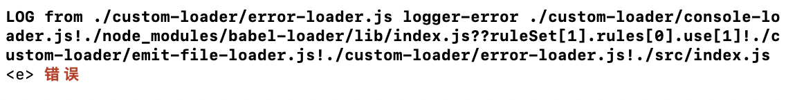
    + `this.emitError`：输出错误日志，不会打断编译流程。与`logger.error`相比，`emitError`会抛出异常的Loader文件、代码行、对应模块，更易定位问题
      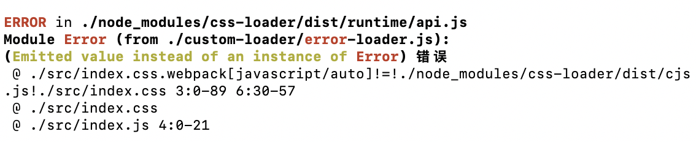
    + `this.callback`：输出错误日志，会打断编译流程，异步错误也用callback
      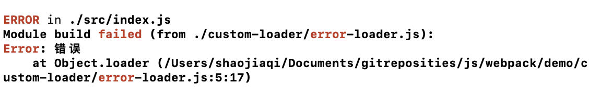

### [schema-utils](https://www.npmjs.com/package/schema-utils)
  > Package for validate options in loaders and plugins.

  开发Loader或Plugin需要对外暴露配置项，一般使用`schema-utils`工具库校验用户传入的配置是否满足需求。
  * 安装
  ```shell
    npm i -D schema-utils
  ```
  * 编写配置对象的描述
  ```json
    // schema.json
    {
      "type": "object",
      "properties": {
        "option": {
          "type": "boolean"
        }
      },
      "required": ["option"],
      "additionalProperties": false
    }
  ```
  * 在Loader中使用
  ```javascript
    // loader.js
    import { validate } from 'schema-utils';
    import schema from 'xxx/schema.json';

    module.exports = function loader(source) {
      const options = this.getOptions();
      validate(schema, options);
      return source
    }

    // Webpack5之后可以直接使用Loader Context的`getOptions`接口完成校验
    module.exports = function loader(source) {
      const options = this.getOptions(schema);
      return source;
    }
  ```
  如果校验不通过，控制台会报错：
  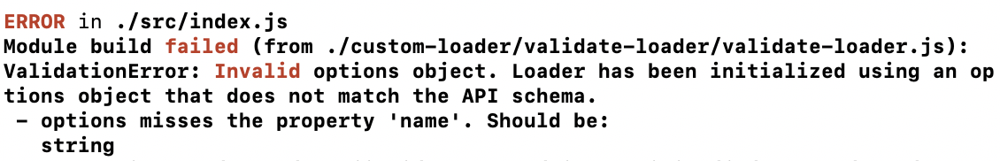

##### [ajv.js](https://ajv.js.org/api.html)
  > `schema-utils`校验能力底层依赖`ajv`。

  * 默认支持七种基本数据类型：
    + `number`：支持整数、浮点数，支持如下校验规则：
      - `maximum`、`minimum`：属性值必须大于等于`minimum`且小于等于`maximum`
      - `exclusiveMaximum`、`exclusiveMinimum`：属性之必须大于`exclusiveMinimum`且小于`exclusiveMaximum`
      - `multipleOf`：属性值必须为`multipleOf`的整数倍，例如对`multipleOf = 5`，则`10/5`符合，`9/4`不符合
    + `integer`：整数，与`number`类似
    + `string`：字符串，支持如下校验规则：
      - `maxLength`、`minLength`：限制字符串最大/最小长度
      - `pattern`：正则匹配限制字符串
      - `format`：声明字符串内容格式，[支持的格式规则](https://github.com/ajv-validator/ajv-formats)
    + `boolean`：bool值
    + `array`：数组，支持如下校验规则：
      - `maxItems`、`minItems`：限制数组最大、最少的元素数量
      - `uniqueItems`：限制数组元素是否唯一
      - `items`：声明数组项的schema描述，数组项内可复用JSON-Schema的任意规则，从而形成嵌套定义结构
        ```json
          {
            "type": "array",
            "items": [{ "type": "integer" }, { "type": "integer" }],
            "additionalItems": { "type": "string" }
          }
        ```
      - `null`：空值，常用于复合`type`类型，例如`type = ['object', 'null']`
    + `object`：对象，支持如下校验规则：
      - `maxProperties`、`minProperties`：限制对象支持的最大、最少属性数
      - `required`：声明必要属性
      - `properties`：定义特定属性的Schema描述，与`array`类似，支持嵌套属性规则
        ```json
          {
            "type": "object",
            "properties": {
              "foo": { "type": "string" },
              "bar": {
                "type": "integer",
                "minimum": 2
              }
            }
          }
        ```
      - `patternProperties`：和`properties`类似，属性名支持正则表达式
        ```json
          {
            "type": "v",
            "patternProperties": {
              "^fo.*$": { "type": "string" }
            }
          }
        ```
      - `additionalProperties`：限制对象是否可以提供除`properties`、`patternProperties`之外的属性
  * 支持一些通用规则：
    + `enum`：枚举，属性值必须完全(deep equal)等于这些值之一
      ```json
        {
          "type": "string",
          "enum": ["foo", "bar"]
        }
      ```
    + `const`：常量，属性值必须完全等于`const定义`
  * 支持复合校验：
    + `not`：数值必须不符合该条件，例如`{ type: 'number', not: { maximum: 3 } }`，传入值必须小于3
    + `anyof`：数值必须满足`anyof`条件之一
      ```json
        // name值只接受string或函数
        {
          "type": "object",
          "properties": {
            "name": {
              "anyof": [{
                "type": "string"
              }, {
                "instance": "Function"
              }]
            }
          }
        }
      ```
    + `oneof`：数值必须满足且仅满足`oneof`条件之一
      ```json
        // 值只能为小于等于3的浮点数，或大于3的整数
        {
          "type": "number",
          "oneof": [{
            "maximum": 3
          }, {
            "type": "integer"
          }]
        }
      ```
    + `if/else/then`：三元表达式组
      ```json
        {
          "type": "object",
          "if": {
            "properties": {
              "foo": { "type": "string" }
            }
          },
          "then": { "required": ["bar"] },
          "else": { "required": ["baz"] }
        }
      ```

##### [loader-utils](https://github.com/webpack/loader-utils)
  > 假若 Loader 需要生成额外的资源文件，建议使用 loader-utils 拼接产物路径

  * `loader-utils`包含四个接口：
    + `urlToRequest`：用于将模块路径转换为文件路径的工具函数
    + `isUrlRequest`：用于判定字符串是否为模块请求路径
    + `getHashDigest`：用于计算内容Hash值
    + `interpolateName`：用于拼接文件名的模板工具

### 插件
  > Webpack对外提供了Loader和Plugin两种扩展方式，其中Loader职责较为单一；Plugin则功能强大，借助Webpack数量庞大的Hook，几乎可以改写Webpack所有特性。

  * 核心对象
    + [Compiler](https://webpack.js.org/api/compiler-hooks/)：全局构建管理器。Webpack启动后会先创建`compiler`对象，
    负责管理配置信息、Loader、Plugin等
    + [Compilation](https://webpack.js.org/api/compilation-hooks/)：单次构建过程的管理器，负责遍历模块，执行编译操作；当`watch = true`时，每次文件变更触发重新编译，都会创建一个新的`compilation`对象
    + 此外还有[NormalModule](https://webpack.js.org/api/normalmodulefactory-hooks/)、[ContextModule](https://webpack.js.org/api/contextmodulefactory-hooks/)、[Parse](https://webpack.js.org/api/parser/)等，也都暴露了很多hook
  * Hook上下文
    + `compiler`对象：
      - `createChildCompiler`：创建子`compiler`对象，子对象会继承原始Compiler的所有配置数据
      - `createCompilation`：创建`compilation`对象，可以借此实现并行编译
      - `close`：结束编译
      - `getCache`：获取缓存接口，可以借此复用Webpack5的缓存功能
      - `getInfrastructureLogger`：获取日志对象
      - 等等
    + `compilation`对象：
      - `addModule`：用于添加模块，例如Module遍历出依赖后，就会调用该接口将新模块加入构建需求中
      - `addEntry`：添加新的入口模块，效果与直接定义`entry`配置相似
      - `emitAsset`：用于添加产物文件，效果与Loader Context的`emitAsset`类似
      - `getDependencyReference`：从给定模块返回对依赖项的引用，常用于计算模块引用关系
      - 等等
    + `module`对象：资源类型，有`NormalModule/RawModule/ContextModule`等子类型，其中`NormalModule`使用频率较高，提供如下接口：
      - `identifier`：读取模块唯一标识符
      - `getCurrentLoader`：读取当前正在执行的Loader对象
      - `originalSource`：读取模块原始内容
      - `serialize/deserialize`：序列化/反序列化函数，用于实现持久化缓存，一般不需要调用
      - `issuer`：模块的引用者
      - `isEntryModule`：判断该模块是否为入口文件
      - 等等
    + `chunk`对象：模块封装容器，提供如下接口：
      - `addModule`：添加模块，之后该模块会与Chunk中其它模块一起打包，生成最终产物
      - `removeModule`：删除模块
      - `containsModule`：判断是否包含某个特定模块
      - `size`：推断最终产物大小
      - `hasRuntime`：判断Chunk中是否包含运行时代码
      - `updateHash`：计算Hash值
    + `stats`对象：统计构建过程中收集到的信息，包括模块构建耗时、模块依赖关系、产物文件列表等
  * 日志处理
    + 使用`compilation.getLogger`获取分级日志管理器(用法和Loader的getLogger相似)
      ```javascript
        const PLUGIN_NAME = 'ConsoleWebpackPlugin';

        class ConsoleWebpackPlugin {
          apply(compiler) {
            compiler.hooks.compilation.tap(PLUGIN_NAME, (compilation) => {
              const logger = compilation.getLogger(PLUGIN_NAME);
              logger.info('消息')
            });
          }
        }

        module.exports = ConsoleWebpackPlugin;
      ```
      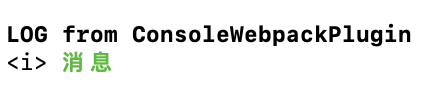
    + 使用`compilation.errors/warning`处理异常信息
      ```javascript
        const PLUGIN_NAME = 'ErrorWebpackPlugin';

        class ErrorWebpackPlugin {
          apply(compiler) {
            compiler.hooks.compilation.tap(PLUGIN_NAME, (compilation) => {
              compilation.errors.push(Error('ConsolePlugins上报的错误'));
              compilation.warnings.push(Error('ConsolePlugins上报的异常'));
            });
          }
        }

        module.exports = ErrorWebpackPlugin;
      ```
      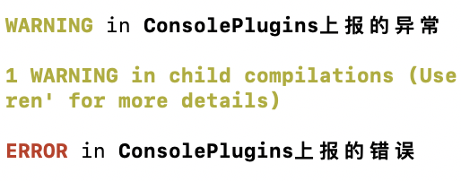
    + 使用Hook Callback<br />
      Hook Callback可以讲错误信息传递到下一个流程，由Hook触发者根据错误内容决定后续处理措施(中断、忽略、记录日志等)。<br />
      注意，不是所有Hook都会传递`callback`函数，实际开发看文档。
    + 直接抛出异常<br />
      这种方式会导致Webpack进程崩溃，多用于插件遇到严重错误。
  * 上报统计信息
    + [ProgressPlugin](https://webpack.js.org/plugins/progress-plugin)<br />
      - 在Webpack中添加实例
        > Provide a handler function which will be called when hooks report progress. handler function arguments：
        >  * `percentage`：a number between 0 and 1 indicating the completion percentage of the compilation
        >  * `message`：a short description of the currently-executing hook
        >  * `...args`：zero or more additional strings describing the current progress

        ```javascript
          // webpack.config.js
          const { ProgressPlugin } = require('webpack');

          module.exports = {
            // ...
            plugins: [
              new ProgressPlugin({
                activeModules: false,
                entries: false,
                handler(percentage, message, ...args) {
                  console.info(`${percentage.toFixed(2) * 100}%`, message, ...args);
                }
              })
            ]
          }
        ```
      
      - 开发插件时，可以使用`ProgressPlugin`插件的`Reporter`方法提交自定义插件的运行进度。
        ```javascript
          // process-console-plugin.js
          const { ProgressPlugin } = require('webpack');

          const PLUGIN_NAME = 'ProgressConsolePlugin';
          const wait = (time) => new Promise(resolve => setTimeout(resolve, time));
          const noop = () => ({});

          class ProgressConsolePlugin {
            apply(compiler) {
              compiler.hooks.emit.tapAsync(PLUGIN_NAME, async (_, callback) => {
                const reportProgress = ProgressPlugin.getReporter(compiler) || noop;
                for (let i = 0; i < 100; i += 1) {
                  await wait(50);
                  reportProgress(i / 100, `当前插件工作进度 ${i}%`);
                }
                reportProgress(1, '当前插件工作完成');
                await wait(1000);
                callback();
              });
            }
          }

          module.exports = ProgressConsolePlugin;
        ```
        ```javascript
          // webpack.config.js
          const { ProgressPlugin } = require('webpack');
          const ProgressConsolePlugin = require('xxx/custom-plugin/progress-console-plugin');

          module.exports = {
            // ...
            plugins: [
              new ProgressPlugin({
                activeModules: false,
                entries: false
              }),
              new ProgressConsolePlugin()
            ]
          }
        ```
      - `stats`是Webpack内置的数据统计机制，可以借助`stats`机制，向用户输出插件的各种信息
        ```javascript
          // stats-plugin.js
          const PLUGIN_NAME = 'StatsPlugin';

          class StatsPlugin {
            apply(compiler) {
              compiler.hooks.compilation.tap(PLUGIN_NAME, (compilation) => {
                compilation.hooks.statsFactory.tap(PLUGIN_NAME, (factory) => {
                  factory.hooks.result.for('module').tap(PLUGIN_NAME, (module) => {
                    // 添加自定义信息
                    module.customStatsInfo = ~~(Math.random() * 100);
                  });
                });
              });
            }
          }

          module.exports = StatsPlugin;
        ```
        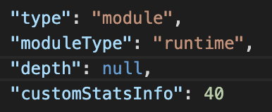

### 单元测试
* 搭建测试环境
  Webpack虽然非常负责，但是本质上还是一个Node程序，可以使用一些Node测试工具搭建自动测试环境。<br />
  以Jest为例：
  > Jest测试代码和逻辑代码是遵从约定优于配置（convention over configuration）其实这个也是目前编程世界普遍接受的原则。
  > Jest的测试代码是基于以下约定：
  > * 测试文件名要以spec结尾
  > * 测试文件后缀为js、jsx、ts、tsx
  > * 测试文件需要放在tests/unit/目录下或者是/tests/目录下 只要满足这三个要求的测试文件，使用运行jest时就会自动执行。

    + 安装
      ```shell
        npm i -D jest babel-jest @babel/core @babel/preset-env
      ```
    + Babel配置
      ```javascript
        // babel.config.js
        module.exports = {
          presets: [
            ['@babel/preset-env', { targets: { node: 'current' } }]
          ]
        };
      ```
    + Jest配置
      ```javascript
        module.exports = {
          testEnvironment: 'node'
        };
      ```
    + 在测试环境运行Webpack
      ```javascript
        import path from "path";
        import webpack from "webpack";
        import { merge } from "webpack-merge";

        export function runCompile(options) {
          const opt = merge(
            {
              mode: 'production',
              entry: path.join(__dirname, './entry.js'),
              output: { path: path.resolve(__dirname, '../dist') },
            },
            options
          );

          return new Promise((resolve, reject) => {
            const compiler = webpack(opt);

            compiler.run((error, stats) => {
              if (error) {
                return reject(error);
              }
              return resolve({ stats, compiler });
            });
          });
        }
      ```
    + 编写测试用例
      ```javascript
        // ConsolePlugin.spec.js
        import { runCompile } from './helpers';
        import ConsolePlugin from '../custom-plugin/console-plugin';

        describe("foo plugin", () => {
          it("should inject foo banner", async () => {
            const {
              stats: { compilation },
              compiler,
            } = await runCompile({
              plugins: [new ConsolePlugin()],
            });
            const { warnings, errors, assets } = compilation;

            expect(warnings).toHaveLength(1);
            expect(errors).toHaveLength(0);
          });
        })
      ```
    + 运行：npm jest --coverage
      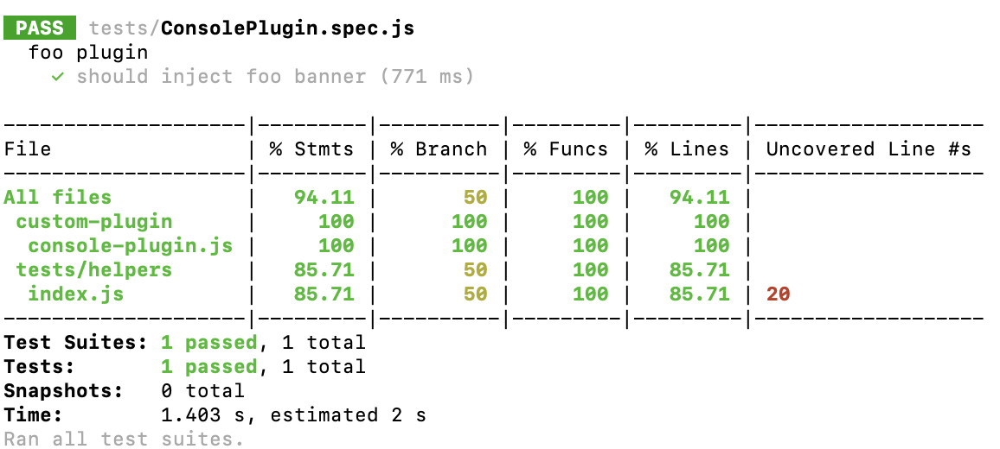

### Hook
##### [Tapable](https://github.com/webpack/tapable)

> Webpack的插件体系是一种基于Tapable实现的强耦合架构，在特定时机触发钩子时会附带足够的上下文信息，插件定义的钩子回调中，能也只能与这些上下文背后的数据结构、接口交互产生side effect，进而影响到编译状态和后续流程。
  * 用法
    ```javascript
      const { SyncHook } = require('tapable');
      // 创建钩子实例
      const demoHook = new SyncHook();
      // 调用订阅接口注册回调
      sleep.tap('test', () => {
        console.log('test callback');
      });
      // 调用发布接口触发回调
      sleep.call();
    ```
    使用Tabable时通常经历三个步骤：
      + 创建钩子实例
      + 调用订阅接口注册回调
      + 调用发布接口触发回调
  * Hook类型
    ```javascript
      const {
        SyncHook,
        SyncBailHook,
        SyncWaterfallHook,
        SyncLoopHook,
        AsyncParallelHook,
        AsyncParallelBailHook,
        AsyncSeriesHook,
        AsyncSeriesBailHook,
        AsyncSeriesWaterfallHook
      } = require("tapable");
    ```
    Hook的类型很多，但整体遵循两种分类规则
      + 按回调逻辑
        - 基本类型：名称不带`Waterfall/Bail/Loop`关键词，与`订阅/回调`模式相似，按钩子注册顺序，逐次调用回调
        - waterfall类型：前一个回调的返回值会带入到下一个回调
        - bail类型：逐次调用回调，若有任何一个回调返回非`undefined`值，则终止后续调用
        - loop类型：逐次、循环调用，直到所有回调函数都返回`undefined`
      + 按回调执行方式
        - sync：同步执行，启动后会按次序逐个执行回调，支持`call/tap`调用语句
        - async：异步执行，支持传入callback或promise风格的异步回调函数，支持`callAsync/tapAsync`、`promise/tapPromise`两种调用语句
  * `SyncHook`<br />
    触发后会按照注册顺序逐个调用回调，且不关心这些回调的返回值。
    ```javascript
      const { SyncHook } = require('tapable');

      class Somebody {
        constructor() {
          this.hooks = {
            demoHook: new SyncHook()
          };
        }

        emit() {
          this.hooks.demoHook.call();
        }
      }

      const person = new Somebody();
      person.hooks.demoHook.tap('test', () => {
        console.log('callback 1');
      });
      person.hooks.demoHook.tap('test', () => {
        console.log('callback 2');
      });
      person.hooks.demoHook.tap('test', () => {
        console.log('callback 3');
      });
      person.emit();
      // 输出：
      // callback 1
      // callback 2
      // callback 3
    ```
    也可以选择异步风格的`callAsync`，选用`call`或`callAsync`并不会影响回调的执行逻辑：按注册顺序依次执行和忽略回调执行结果，两者唯一的区别是`callAsync`需要传入`callback`函数，用于处理回调队列可能抛出的异常。
    ```javascript
      // callAsync风格
      this.hooks.demoHook.callAsync((err) => {
        if (err) { // ... }
      });
    ```
  * `SyncBailHook`<br />
    `bail`单词有熔断的意思，`bail`类型钩子的特点是在回调队列中，若任意回调返回了非`undefined`值，则中断后续处理，直接返回该值。<br />
    `SyncBailHook`的调用顺序与规则都和`SyncHook`相似，主要区别是`SyncBailHook`增加了熔断逻辑。
    ```javascript
      const { SyncBailHook } = require('tapable');

      class Somebody {
        constructor() {
          this.hooks = {
            demoHook: new SyncBailHook()
          };
        }
        
        emit() {
          return this.hooks.demoHook.call();
        }
      }

      const person = new Somebody();
      person.hooks.demoHook.tap('test', () => {
        console.log('callback 1');
        return 'value';
      });
      person.hooks.demoHook.tap('test', () => {
        console.log('callback 2');
      });
      console.log(person.emit());
      // 输出：
      // callback 1
      // value
    ```
    `SyncBailHook`通常用在发布者需要关心订阅回调运行结果的场景，例如Webpack会根据某些钩子的运行结果决定是否执行后续操作。
  * `SyncWaterfallHook`<br />
    `waterfall`类型钩子特点是将前一个函数的结果作为参数传入下一个函数，最后一个回调的结果作为`call`调用的结果返回。
    ```javascript
      const { SyncWaterfallHook } = require('tapable');

      class Somebody {
        constructor() {
          this.hooks = {
            demoHook: new SyncWaterfallHook(['param'])
          };
        }

        emit() {
          this.hooks.demoHook.call('初始参数');
        }
      }

      const person = new Somebody();
      person.hooks.demoHook.tap('test', (arg) => {
        console.log(`调用初始参数：${arg}`);
        return '参数1';
      });
      person.hook.demoHook.tap('test', (arg) => {
        console.log(`调用上一个回调返回结果：${arg}`);
        return '最后一个参数';
      });
      console.log('最终结果：' + person.emit());
      // 输出：
      // 调用初始参数：初始参数
      // 调用上一个回调返回结果：参数1
      // 最终结果：最后一个参数
    ```
    `SyncWaterfallHook`初始化时必须提供参数，用于动态编译`call`的参数依赖，发布调用`call`时，需要传入初始参数。
  * `SyncLoopSync`<br />
    `loop`类型钩子的特点是循环执行，直到所有回调都返回`undefined`。
    ```javascript
      const { SyncLoopHook } = require('tapable');

      class Somebody {
        constructor() {
          this.hooks = {
            demoHook: new SyncLoopHook()
          };
        }

        emit() {
          return this.hooks.demoHook.call();
        }
      }

      const person = new Somebody();
      let i = 0;
      person.hooks.demoHook.tap('test', () => {
        i += 1;
        console.log(`第${i}次执行执行回调A`);
        if (i <= 2) {
          return i;
        }
      });

      person.hooks.demoHook.tap('test', () => {
        console.log('执行回调B')
      });

      person.emit();
      // 输出：
      // 第1次执行回调A
      // 第2次执行回调A
      // 第3次执行回调A
      // 执行回调B
    ```
  * `AsyncSeriesHook`<br />
    `AsyncSeriesHook`支持异步回调，可以在回调函数中写`callback`或`promise`风格的异步操作，回调队列依次执行，与`SyncHook`一样，不关心回调结果。
    ```javascript
      const { AsyncSeriesHook } = require('tapable');

      const hook = new AsyncSeriesHook();
      hook.tapAsync('test', (callback) => {
        console.log('回调A异步开始');
        setTimeout(() => {
          console.log('回调A异步结束');
          callback();
        }, 1000);
      });
      hook.tapAsync('test', () => {
        console.log('回调B');
      });

      hook.callAsync();
      // 输出：
      // 回调A异步开始
      // 回调A异步结束
      // 回调B
    ```
    也可以通过promise风格调用，区别是需要将`tapAsync`改为`tapPromise`，Tap回调需要返回Promise，`callAsync`需要改为`promise`。
    ```javascript
      const { AsyncSeriesHook } = require('tapable');

      const hook = new AsyncSeriesHook();
      hook.tapPromise('test', () => Promise.resolve());

      hook.promise();
    ```
  * `AsyncParallelHook`<br />
    与`AsyncSeriesHook`类似，`AsyncParallelHook`也支持异步风格的回调，不过是以并行的方式，同时执行回调队列里所有回调，并且与`SyncHook`一样不关心回调的执行结果。
  * Hook动态编译<br />
    Webpack中的hook底层都基于Tapable的**动态编译**实现。<br />
    不同Hook中的同步、异步、bail、waterfall、loop等回调规则都是Tapable根据Hook类型、参数、回调队列等参数，调用`new Function`语句动态拼装出一段控制执行流程的JS代码实现的。<br />
    使用`new Function`实现Hook设计的原因，以`AsyncSeriesWaterfallHook`为例：
    ```javascript
      const { AsyncSeriesWaterfallHook } = require('tapable');

      const hook = new AsyncSeriesWaterfallHook(['name']);

      hook.tapAsync('test', (text, cb) => {
        console.log(`${text} world 1`)
        setTimeout(() => {
          cb(undefined, `${text} world`);
        });
      });

      hook.tapAsync('test', (text, cb) => {
        console.log(`${text} world 2`)
        setTimeout(() => {
          cb(undefined, `${text} !`);
        });
      });

      hook.callAsync('hello', (err, text) => {
        if (err !== undefined) {
          console.log('text');
        } 
      });

      // 输出：
      // hello world 1
      // hello world 2
      // hello world !
    ```
    `AsyncSeriesWaterfallHook`的特点是异步串行，前一个回调的返回值会传入下一个回调，对应动态生成函数：
    ```javascript
      (function anonymous(text, _callback) {
        "use strict";
        var _context;
        var _x = this._x;
        function _next0() {
          var _fn1 = _x[1];
          _fn1(text, function(_err1, _result1) {
            if (_err1) {
              _callback(_err1);
            } else {
              if (_result1 !== undefined) {
                text = _result1;
              }
               _callback(null, text);
            }
          });
        }
        var _fn0 = _x[0];
        _fn0(text, function(_err0, _result0) {
          if (_err0) {
            _callback(_err0);
          } else {
            if (_result0 !== undefined) {
              text = _result0;
            }
            _next0();
          }
        });
      });
    ```
    可以看到生成函数将回调队列中各项封装为`_nextX`函数，这些`next`函数内部逻辑高度相似，并按照回调定义顺序依次串行执行。<br />
    相比其它实现方式，动态生成的`AsyncSeriesWaterfallHook`函数逻辑更易理解。
  * 高级特性：Intercept<br />
    tapable提供了简易的中间件机制 —— `intercept`接口。
    ```javascript
      const { SyncHook } = require('tapable');

      const hook = new SyncHook();
      hook.intercept({
        name: 'test',
        context: true,
        call() {},
        loop() {},
        tap() {},
        register() {},
      });
    ```
    `intercept`支持注册的中间件：
    | 签名 | 解释 |
    | --- | --- |
    | call: (...args) => void | 调用`call/callAsync/promise`时触发 |
    | tap: (tap: Tap) => void | 调用`call`类函数后，每次调用回调之前触发 |
    | loop: (...args) => void | 仅`loop`型的钩子有效，在循环开始之前触发 |
    | register: (tap: Tap) => Tap | undefined | 调用`tap/tapAsync/tapPromise`时触发 |
  * 高级特性：HookMap<br />
    HookMap可以降低创建和使用的复杂度，使用简单。
    ```javascript
      const { SyncHook, HookMap } = require('tapable');

      const hook = new HookMap(() => new SyncHook());

      hook.for('condition').tap('test', () => {});
      hook.get('condition').call();
    ```
    HookMap可以实现动态获取钩子的能力，这样就无需在初始化时为每种情况创建对应钩子，只需在使用时动态创建、获取对应实例即可。
    ```javascript
      const { SyncHook, HookMap } = require('tapable');

      class Somebody {
        constructor() {
          this.hooks = {
            demoHook: new HookMap(() => new SyncHook())
          };
        }

        walk() {
          const hooks = this.hooks.demoHook.get('condition');
          if (hooks) {
            // ...
          }
        }
      }
    ```


        

    


