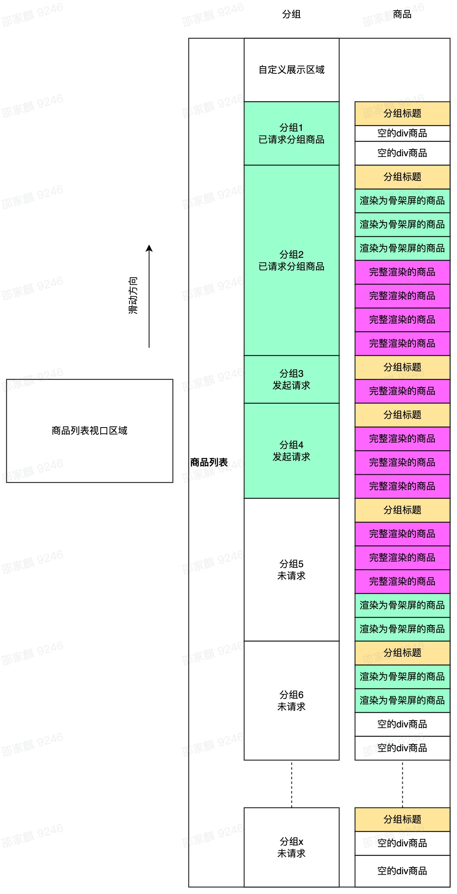
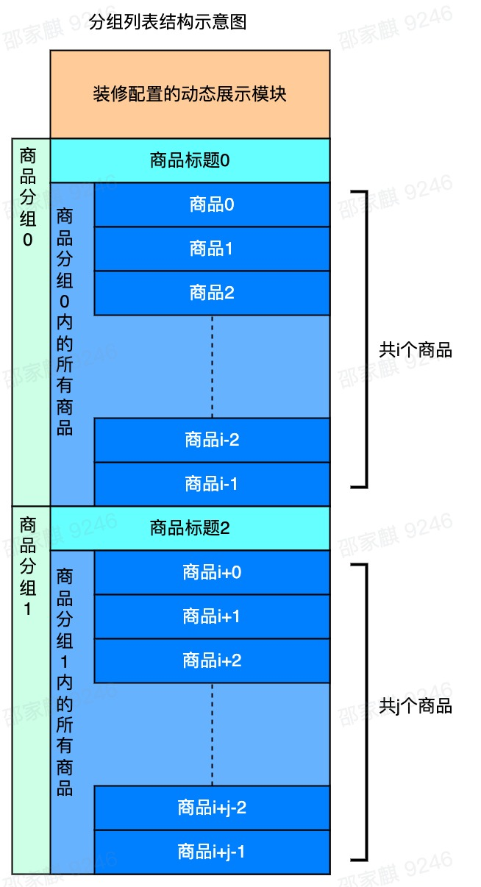

# 我在有赞做小程序性能优化
22年年初，我们要开启第二轮性能优化，在这之前我们就收到过很多商家反馈，商品列表使用卡顿，于是借此机会，我们把商品列表完整重构了一版，自己实现一个虚拟列表来大幅提升用户体验。

## 现状
点单宝点单页商品列表界面和大多数点餐小程序相似，左侧一级分组导航，右侧商品列表，两者相互联动，点击导航分组，列表滑动到指定分组，同样滑动列表，对应分组高亮。右侧列表每个分组顶部是分组标题，分组标题由标题和二级分组组成，滑动列表过程中，分组标题由吸顶效果，且二级分组和对应二级商品相互联动。滑动过程中，分组无缝衔接。

我们提供给商家丰富的自定义装修配置。在商品列表上我们支持列表模式、大图模式、一行两列模式等六种布局，同时提供了数十个自定义选项和开关，用户可以设置履约时效、图片标签、描述等是否展示。点单宝商品是自适应高度，最极端的场景下——用户把所有个性化配置开启，单个商品高度比默认高度（图片高度）高出一倍。

我们商家在列表配置的商品总数95%都在1000内，有3%的商家配置的商品总数超过2000。

## 虚拟列表
虚拟列表不是一个新鲜技术，核心原理也非常简单：让视口区域内的内容渲染，区域外的内容回收。在移动端，由于设备性能与屏幕大小限制，虚拟列表在长列表场景下优化效果明显。

### 实现思路
虚拟列表实现思路基本上分为两种：高度计算与DOM节点监听。

#### 高度计算
获取到列表滚动距离scrollTop，加上总商品数量totalCount，单个商品高度itemHeight和渲染商品数量renderCount就可以计算出：
  ```javascript
    const scrollViewHeight = itemHeight * totalCount; // 虚拟列表高度
    const renderStartIndex = ~~(scrollTop / itemHeight); // 渲染起始元素下标
    const renderEndIndex = renderStartIndex + renderCount; // 渲染结束元素下标
    const renderStartOffset = renderStartIndex * itemHeight; // 渲染起始元素距离列表顶部偏移量
  ```
有些这些数据，就可以将列表中在区间`[renderStartIndex, renderEndIndex)`内的元素渲染出来，同时给虚拟列表容器加上`padding-top: ${renderStartOffset}px`或`transform: translate3d(0, ${renderStartOffset}px, 0)`来模拟列表滚动到某个区域的效果。

高度计算的优点是性能非常好，因为实际渲染的节点数是固定的，并且如果单个Item高度固定，那么代码实现也非常简单，兼容性好。缺点也很明显，如果Item的高度自适应，那么计算就比较麻烦。

针对高度计算中的商品自适应，一般有两种动态计算方案：
* 提前计算

提前通过判断商品需要展示的元素，动态计算出每个商品的高度，优点是可以在服务端计算，客户端使用体验提升，缺点是根据布局、商品自身展示元素的复杂度，动态计算的难度指数级上升，且后续业务迭代都要考虑动态计算方法是否需要调整。

* 逻辑高度 + 获取实时高度

初始化阶段依旧按照逻辑高度（默认高度，一般就是商品最小高度）来计算，商品渲染后，获取一次商品实际高度，维护在数组内，后续动态计算判断是否存在实际高度，存在用实际高度，不存在用逻辑高度。优点是兼容性更好（包括对后续业务迭代兼容），缺点是存在额外的DOM开销。

#### 监听器
WebApi提供了[`IntersectionObserver Api`](https://developer.mozilla.org/zh-CN/docs/Web/API/IntersectionObserver)(小程序内封装了这个Api，提供了[IntersectionObserver相关Api](https://developers.weixin.qq.com/miniprogram/dev/api/wxml/IntersectionObserver.html))，该Api供了一种异步观察目标元素与其祖先元素或顶级文档视口（viewport）交叉状态的方法。

只需要给元素挂载上监听器，并指定参照区域为视口容器，那么当元素进入或离开参照区域，都会触发该监听器的回调：
  ```javascript
    // 以小程序Api为例
    const ENTER = 'enter';
    const LEAVE = 'leave';
    export function createObserver(dom, viewPortDom, enterCb, leaveCb) {
      const ob = wx.createIntersectionObserver();
      // 收缩参照节点布局区域上下各50px，让监听器更早触发
      ob.relativeTo(viewPortDom, {
        top: -50,
        bottom: -50,
      }).observe(dom, ({ intersectionRatio }) => {
        const state = intersectionRatio <= 0 ? LEAVE : ENTER;
        state === ENTER ? enterCb() : leaveCb();
      });
      return ob.disconnect;
    }
  ```

监听器的好处是web支持的Api，直接用就好，不需开发做额外计算。缺点是监听器需要绑定在DOM节点上，那么就需要提前做好空节点占位再绑定监听器，DOM节点就会比高度计算的方式多很多，同时监听器占用内存（如果监听器过多，一样影响页面性能），且创建的监听器需要手动回收，需要一些额外的心智成本。

### 选型
在现状里提到过我们现有的商家95%商品总数在1000内（大部分商家商品总数在80内），所以DOM节点数不会过多，其次我们支持多种布局和个性化配置，那么如果做高度提前计算的话复杂度非常高（需要针对每种布局写一套），如果用逻辑高度+实时获取的方案，那么依旧存在多列布局场景需要获取每一行最高商品的高度，也很麻烦。

如果用监听器的方式，那么就不再依赖布局和配置数据（无需任何动态计算），因为监听器只依赖DOM节点，只要节点进入参照区就会触发监听器回调。

监听器的方式可以有效避免计算成本，当然也存在问题：
1. 监听器需要绑定在真实DOM上
2. 监听器占用内存，数量过多影响性能
3. 参照物区间内可能有多个监听器同时触发回调

对于上述问题，也有对应策略：
1. 根据商品总数先渲染对应数量的空节点（1000个空节点实测对性能有影响，但是可接受），渲染完再绑定监听器
2. 监听器的目的是为了告知哪些商品应该被完整渲染，那么只需要保证参照区域内有一个商品能触发监听器，以该商品下标为参照，上下各n个商品都完整渲染即可，那么可以大幅减少监听器数量
3. 通过第二点可以控制监听器数量，那么参照物区间监听器触发的回调数就少了，同时可以采用类似以参照物区间内第一个触发的监听器为准，其他监听器的回调丢弃

## 方案设计
### 商品列表渲染示意图


### 监听器绑定规则
* 一级分组监听器

每个分组容器绑定监听器，负责控制是否需要请求该分组商品以及和通知导航对应分组高亮。

* 商品关联渲染监听器

每n个商品以及每个一级分组内头尾两个商品绑定一个监听器，当第i个监听器触发回调时，如果对应绑定的商品是进入参照区域，则将下标在[i - renderCount, i + renderCount]区间内的商品完整渲染，将下标在[i - skeletonRenderCount, i + skeletonRenderCount]区间内的商品渲染为骨架屏（优先级低于完整渲染商品），将区间外的商品回收为占位块。

* 商品关联二级分组监听器

每个二级分组内头尾两个商品（如果二级分组内只有一个商品，则只有头）绑定一个监听器，如果绑定监听器的商品触发进入参照区域，通知对应二级分组高亮。

通过对不同监听器功能的分类，每种类型的监听器只做一件事，将分组的请求与商品的渲染区分开来，同时，这样的设计还有一个好处，当某个待渲染的商品进入参照区域，但分组请求未返回，那么会先渲染为骨架屏，避免出现白屏场景。

### 商品分组列表实际模型图


小程序提供了scrollView组件，可以通过`scroll-into-view`属性快速定位到指定id的DOM节点，同时切换一级分组需要滚动到对应分组，切换二级分组需要滚动到指定商品，所以设计上将分组与商品拍平排列在列表内。一级分组id命名格式为`list-group-${groupId}`，商品id命名格式为`list-goods-${goodsIndex}`。

对于商品id命名依赖的商品下标goodsIndex，我们只需要额外维护一个分组商品数的前缀和数组goodsListPrefixCount，即可通过`goodsListPrefixCount[currentGroupIndex] + goodsIndexInCurrentGroup`快速得到当前商品在总商品中的下标。

### 前置依赖与加载流程
该模型下需要前置获取商品一级分组信息和每个一级分组内商品总数。同时也可包含二级分组信息。
  ```json
    {
      "groups": [{
        "id": "groupId1",
        "title": "一级分组1",
        "count": 10,
        "children": [{
          "id": "groupId11",
          "title": "二级分组1",
          "count": 2
        }, {
          "id": "groupId12",
          "title": "二级分组2",
          "count": 8
        }]
      }, {
        "id": "groupId2",
        "title": "一级分组2",
        "count": 20
      }]
    }
  ```

初始化阶段，通过分组数据，渲染出左侧导航和右侧列表中分组标题信息，同时根据分组信息中分组数量，提前渲染对应数量个占位元素。渲染完成后根据监听器绑定规则对相应DOM节点绑定。

当分组进入视口区域，则请求该分组下商品信息，同时高亮相应一级分组；当商品监听器进入视口区域，若是商品关联渲染监听器，则按照既定规则对相应商品做完整渲染/骨架屏渲染/回收操作，若是商品关联二级分组监听器，则高亮对应二级分组。

若视口区域中有多个分组监听器或多个商品关联二级分组监听器触发进入，则以下标最小的为准。

这样处理也将数据请求与渲染逻辑分离开来。

### 初版商品列表核心代码
* 商品列表wxml
  ```html
    <scroll-view
      id="parentContainer"
      scroll-anchoring
      show-scrollbar="{{ false }}"
      scroll-y="{{ true }}"
      scroll-into-view="list-{{ scrollIntoViewId }}"
    >
      <slot name="header"></slot>
      <view
        wx:for="{{ groups }}"
        wx:for-item="group"
        wx:for-index="i"
        key="{{ group.id }}"
        id="list-group-{{ group.id }}"
      >
        <group-title
          group="{{ group }}"
          current-second-group-id="{{ currentSecondGroupId }}"
        />
        <goods-item
          wx:for="{{ goodsList[i] }}"
          wx:for-item="goods"
          wx:for-index="j"
          key="{{ j }}"
          id="list-goods-{{ goodsListPrefixCount[i] + j }}"
          goods="{{ goods }}"
          goods-index="{{ goodsListPrefixCount[i] + j }}"
          render-goods-start-idx="{{ renderGoodsStartIdx }}"
          render-goods-end-idx="{{ renderGoodsEndIdx }}"
        />
      </view>
    </scroll-view>
  ```

* 商品列表js
  ```javascript
    const OBSERVER_THRESHOLD = 75;
    Component({
      props: {
        groups: Array,
        currentGroupId: String,
        groupChangeType: String,
      },
      data: {
        scrollIntoViewId: '',
        currentSecondGroupId: '',
        goodsList: [],
        goodsListPrefixCount: [],
      },
      observers: {
        groups(groups) {
          if (Array.isArray(groups)) {
            this._groupRequest = {};
            this.clearGroupObservers();
            this.clearGoodsObservers();
            const goodsListPrefixCount = [0];
            const goodsList = [];
            groups.forEach(({ count }, i) => {
              goodsListPrefixCount.push(goodsListPrefixCount[i] + count);
              goodsList.push(Array(count).fill({}));
            });
            this.onBatchGetGoodsList();
            this.setData({
              goodsListPrefixCount,
              goodsListExtraDataList: Array(val.length).fill({}),
              goodsList,
            }, () => {
              setTimeout(() => {
                this.createGroupObservers();
                this.createGoodsObservers();
              }, 200);
            });
          }
        },
        currentGroupId(val) {
          if (this.data.groupChangeType === 'click') {
            // 仅通过手动点击左侧导航切换分组，需要商品列表定位到指定分组
            this.setData({
              scrollIntoViewId: `group-${val}`,
            });
          }
        }
      },
      created() {
        this._groupRequest = {}; // 是否请求过商品列表
        this._groupIntersectionObservers = []; // 商品分组监听器
        this._goodsIntersectionObservers = []; // 商品展示监听器
        this._goodsSecondGroupIntersectionObservers = []; // 商品二级分组监听器
        this._groupActiveMap = {}; // 当前处于视口区域的分组
        this._goodsSecondGroupActiveMap = {}; // 当前处于视口区域的二级分组中的商品
        this._currentGroupChangeType = 'scroll'; // 当前分组激活的方式，默认滚动激活
        this._halfRenderCount = 12; // 控制不同布局下渲染商品的数量
      },
      detached() {
        this.clearGroupObservers();
        this.clearGoodsObservers();
      },
      methods: {
        onBatchGetGoodsList() {
          if (this.groups.length > 0) {
            // 1、默认请求前2个分组
            // 2、如果有_groupActiveMap，则请求视口区域内的分组+视口区域上方的一个分组
            let start = 0;
            let end = 1;
            const keys = Object.keys(this._groupActiveMap);
            if (keys.length) {
              start = +keys[0] - 1;
              end = +keys[keys.length - 1];
            }
            while (start <= end) {
              if (!this._groupRequest[start]) {
                this._groupRequest[start] = 1; // 已经请求过
                this.getGoodsList(start);
              }
              start += 1;
            }
          }
        },
        async getGoodsList(i) {
          const goodsList = await wx.request();
          this.setData({
            [`goodsList[${i}]`]: goodsList,
          });
        },
        createGroupObservers() {
          const { groups } = this.data;
          for (let i = 0; i < groups.length; i += 1) {
            const ob = wx.createIntersectionObserver();
            this._groupIntersectionObservers.push(ob);
            ob.relativeTo('#parentContainer', {
              top: -OBSERVER_THRESHOLD,
              bottom: -OBSERVER_THRESHOLD
            }).observe(`#list-group-${groups[i].id}`, ({ intersectionRatio }) => {
              if (intersectionRatio > 0) {
                this._groupActiveMap[i] = groups[i].id;
              } else {
                delete this._groupActiveMap[i];
              }
              const key = Object.keys(this._groupActiveMap)[0];
              this.onBatchGetGoodsList();
              if (key !== undefined) {
                this.triggerEvent('change-group', this.groups[key].id, 'scroll');
              }
            });
          }
        },
        clearGroupObservers() {
          let i = this._groupIntersectionObservers.length;
          while (i--) {
            const ob = this._groupIntersectionObservers.pop();
            ob.disconnect();
          }
          this._groupActiveMap = {};
        },
        createGoodsObservers() {
          const { goodsListPrefixCount, groups } = this.data;
          // 商品展示层级的监听器
          const totalCount = goodsListPrefixCount[goodsListPrefixCount.length - 1];
          let j = 1;
          for (let i = 0; i < totalCount; i += 1) {
            // 定制规则
            // 为了优化抖动问题，每个一级分组内最后一个商品需要加监听器
            // 商品数前缀和数组内每个值都是下一个分组内第一个商品的下标
            // 那么就是前缀和数组内每个值对应的下标的前一个商品都要加监听器
            if (
              j < goodsListPrefixCount.length &&
              i === goodsListPrefixCount[j] - 1
            ) {
              this.createGoodsFirstGroupObservers(i);
              j += 1;
              continue; // 避免和通用监听器规则重复添加，命中定制规则直接continue
            }
            // 通用规则
            if (i % 4 === 0 || i === totalCount - 1) {
              this.createGoodsFirstGroupObservers(i);
            }
          }
          // 二级分组监听器
          // 二级分组监听器仅控制商品和二级分组联动
          // 二级分组监听器的规则是每个二级分组内的第一个（和最后一个）商品加监听器
          let i = 0;
          groups.forEach(({ children, count }) => {
            if (children.length) {
              children.forEach(({ count, id }) => {
                // 二级分组无商品，跳过
                if (count === 0) return;
                // 给二级分组次中第一个商品加监听器
                this.createGoodsSecondGroupObservers(i, id);
                i += count; // 下一个二级分组中第一个商品的的idx
                if (count > 1) {
                  // 二级分组中存在2个以上的商品
                  // 则给二级分组中最后一个商品也加监听器
                  this.createGoodsSecondGroupObservers(i - 1, id);
                }
              });
            } else {
              // 如果没有二级分组，就计算下一个可能存在的二级分组中第一个商品的idx
              i += count;
            }
          });
        },
        createGoodsFirstGroupObservers(i) {
          // 创建一级分组内商品监听器
          const ob = wx.createIntersectionObserver();
          this._goodsIntersectionObservers.push(ob);
          ob.relativeTo('#parentContainer', {
            top: -OBSERVER_THRESHOLD,
            bottom: -OBSERVER_THRESHOLD,
          }).observe(`#list-goods-${i}`, ({intersectionRatio }) => {
            if (intersectionRatio > 0) {
              this.setData({
                activeGoodsObserverIdx: i,
                renderGoodsEndIdx: i - this._halfRenderCount,
                renderGoodsStartIdx: i + this._halfRenderCount
              });
            }
          });
        },
        createGoodsSecondGroupObservers(i, groupId) {
          // 创建二级分组内商品监听器
          const ob = wx.createIntersectionObserver();
          this._goodsSecondGroupIntersectionObservers.push(ob);
          ob.relativeTo('#parentContainer', {
            top: -OBSERVER_THRESHOLD,
            bottom: -OBSERVER_THRESHOLD,
          }).observe(`#list-goods-${i}`, ({ intersectionRatio }) => {
            if (intersectionRatio > 0) {
              this._goodsSecondGroupActiveMap[i] = groupId;
            } else {
              delete this._goodsSecondGroupActiveMap[i];
            }
            const key = Object.keys(this._goodsSecondGroupActiveMap)[0];
            if (key !== undefined) {
              this.setData({
                currentSecondGroupId: this._goodsSecondGroupActiveMap[key],
              })
            }
          });
        },
        clearGoodsObservers() {
          let i = this._goodsIntersectionObservers.length;
          while (i--) {
            const ob = this._goodsIntersectionObservers.pop();
            ob.disconnect();
          }
          i = this._goodsSecondGroupIntersectionObservers.length;
          while (i--) {
            const ob = this._goodsSecondGroupIntersectionObservers.pop();
            ob.disconnect();
          }
          this._goodsSecondGroupActiveMap = {};
        },
      }
    });
  ```

* 商品渲染判定js
  ```javascript
    Component({
      properties: {
        goods: Object,
        goodsIndex: Number,
        renderGoodsStartIdx: Number,
        renderGoodsEndIdx: Number,
      },
      data: {
        needRender: false,
        needRenderSkeleton: false,
      },
      observers: {
        goods(val) {
          if (val.id) this.checkRender();
        },
        renderGoodsStartIdx(val) {
          this.checkRender();
        }
      },
      methods: {
        checkRender() {
          let needRender = false;
          let needRenderSkeleton = false;
          const { goods, goodsIndex, renderGoodsStartIdx, renderGoodsEndIdx, needRender: originNeedRender, needRenderSkeleton: originNeedRenderSkeleton } = this.data;
          if (goods.id) {
            needRender =
              goodsIndex >= renderGoodsStartIdx &&
              goodsIndex <= renderGoodsEndIdx;
          }
          // 不渲染商品则判断是否要渲染骨架屏
          if (!needRender) {
            // 上下各（_halfRenderCount + 40）个商品渲染骨架屏
            needRenderSkeleton =
              goodsIndex > renderGoodsStartIdx - 40 &&
              goodsIndex < renderGoodsEndIdx + 40;
          }
          const obj = {};
          if (needRender !== originNeedRender) obj.needRender = needRender;
          if (needRenderSkeleton !== originNeedRenderSkeleton) obj.needRenderSkeleton = needRenderSkeleton;
          this.setData(obj);
        }
      },
    });
  ```

## 缺陷与优化
### 部分机型锚定失效与高度崩塌导致的页面抖动
由于商品高度是自适应的，当商品渲染为骨架屏或占位元素，我们仅为它设置一个逻辑高度（通常是图片高度）来让其撑开部分高度，这样就可以用户就可以正常滚动列表。但是商品如果完整渲染高度比逻辑高度高，那么就会有个高度差diff，n个商品完整渲染就可能有`n * diff`的高度差totalDiff。

而现状说提到点单宝的商品最大高度可以比逻辑高度高出一倍，那么即使控制了完整渲染商品的数量，依然可能出现由于高度崩塌导致页面抖大半屏的场景出现。

#### 场景一：列表滑动停止时
如果用户下滑列表，停止时，视口区域上方的商品触发回收，导致视口区域上方实际总高度变小了totalDiff，视口区域内商品会向上再滑动totalDiff（被推上去）；同理，如果用户上滑列表，视口区域上方的商品触发渲染，导致视口区域上方实际总高度变大了totalDiff，视口区域内商品会向下再滑动totalDiff（被挤下来）。

这种场景很好优化，只需要设置css样式`overflow-anchor: auto`(iOS上，scrollView直接提供了属性，只需要开启，安卓上需要手动添加CSS属性)即可让滚动锚定生效。

#### 场景二：手动切换分组（一）
用户手动切换分组，那么列表会定位到目标分组内第一个商品的位置，同时这个商品上方n个商品也会完整渲染，导致视口区域上方实际总高度变大了totalDiff，视口区域内商品会被挤下来totalDiff高度。

在这种场景下，iOS和鸿蒙内核收集滚动锚定属性不会生效。解决办法是修改渲染条件，如果通过手动切换分组方式触发了商品关联渲染监听器，那么从当前分组内第一个商品开始渲染，视口区域上方的商品只渲染为骨架屏，即renderGoodsStartIdx设置为当前商品分组内第一个商品的下标，后续当用户向下滑动列表时，触发上个分组内商品关联渲染监听器，再行判断。
  ```javascript
    createGoodsFirstGroupObservers(i) {
      const ob = wx.createIntersectionObserver();
      this._goodsIntersectionObservers.push(ob);
      ob.relativeTo('#parentContainer', {
        top: -OBSERVER_TOP_THRESHOLD,
        bottom: -OBSERVER_TOP_THRESHOLD,
      }).observe(`#list-goods-${i}`, ({ intersectionRatio }) => {
        if (intersectionRatio > 0) {
          let renderGoodsStartIdx;
          if (this._currentGroupChangeType !== 'click') {
            // 如果不是点击切换分组，则按正常规则渲染商品
            renderGoodsStartIdx = i - this._halfRenderCount;
          } else {
            // 若是点击切换分组
            // 由于商品自适应布局问题，可能导致抖动
            // 所以点击切换的场景下，从当前商品开始渲染
            // 但是若当前商品之后已经不足一屏的商品，还需要往上多渲染几个商品
            const { groupIndexMap, goodsListPrefixCount } = this.data;
            const groupIdx = groupIndexMap[this.currentGroupId];
            const remainGoodsNum =
              goodsListPrefixCount[goodsListPrefixCount.length - 1] -
              goodsListPrefixCount[groupIdx];
            if (remainGoodsNum < 12) {
              // 剩余商品不足12个
              renderGoodsStartIdx = i - 12;
            } else {
              renderGoodsStartIdx = goodsListPrefixCount[groupIdx];
            }
            // _currentGroupChangeType是click，优先按照click处理完后，立即切scroll状态
            // 这样可以避免用户切换分组后向上滑动上面一个商品还是骨架屏
            this._currentGroupChangeType = 'scroll';
          }
          this.setData({
            activeGoodsObserverIdx: i,
            renderGoodsEndIdx: i + this._halfRenderCount,
            renderGoodsStartIdx,
          });
        }
      });
    }
  ```

#### 场景三：手动切换分组（二）
在场景二中，我们解决了切换分组后视口区域上方分组的商品渲染导致的高度挤压的问题。那么如果从分组a切换到分组c
时，我们只从分组c内第一个商品开始渲染，分组c上方分组b内的商品不会渲染，但是分组a内已经渲染的商品触发回收，这又导致了视口区域上方高度减少了totalDiff，表现就是分组c内商品向上滑动一了totalDiff，并未停留在分组c内第一个商品。

也就是说商品回收也可能导致页面抖动，同时只要让商品回收时高度不变就可以解决该问题。

我们从高度计算中的第二种方案得到启发，商品列表初始化占位元素依旧设置逻辑高度，完整渲染时依旧让其自适应，当该商品触发回收事件时不立即让其回收，获取该商品真实高度后先修改该商品占位元素高度再回收。
  ```javascript
    // 商品组件
    const DEFAULT_HEIGHT = 100;
    Component({
      created() {
        this._hasQueryHeight = false;
      },
      methods: {
        checkRender() {
          /*
           * some code here
           */
          let obj = {};
          if (needRender !== originNeedRender) {
            obj.needRender = needRender;
            if (!this._hasQueryHeight && !needRender) {
              // 如果没有获取过商品渲染高度，且商品需要被回收
              // 则获取一次DOM真实高度
              // 同时小程序createSelectorQueryApi就是异步的
              // 不会影响当前视口区域内元素渲染
              this._hasQueryHeight = true;
              this.createSelectorQuery()
                .select('#goods-item')
                .boundingClientRect()
                .exec(([{ height }]) => {
                  obj.height = height;
                  this.setData(obj);
                });
              return;
            }
          }
          if (needRenderSkeleton !== originNeedRenderSkeleton) obj.needRenderSkeleton = needRenderSkeleton;
          this.setData(obj);
        }
      },
    });
  ```

### 商家商品总数区间差过大
我们商家配置的商品总数最少的只有个位数，最多的超过2600个，大部分配置商品总数在10到80之间，所以一套渲染方案肯定难以让所有商家获得一样的性能体验。

我们围绕商品总数，手机性能，用户体验等几个因素制定了一套多级渲染策略：
1. 商品总数小于80：所有商品全量请求，全量渲染。

  我们希望商品总数越少的商家有越极致的体验，现代手机的机能直接渲染80个商品完全无卡顿。全量渲染的好处是用户滑动列表、切换分组都不会有商品渲染的过程，体验非常好，同时不再需要绑定商品关联渲染监听器。缺点是稍微牺牲一点首开性能（并发请求了所有商品分组），但是因为商品总数少，接口响应快，体感上差别不大。

2. 商品总数在80到600之间：增量式渲染，按照一级分组监听器请求对应分组，按照商品关联渲染监听器渲染商品，商品不回收。

  我们希望商品总数在这个区间内的商家既能保证首开的性能，又能有流畅的产品体验。对这类商家来说，相比基础版虚拟列表我们取消了商品回收，只做增量式渲染。那么这类商家的用户可以体验极致的首开性能，同时查看商品列表时，最多只有一次商品渲染过程。

3. 商品总数大于600的商家：对比第二条，启用商品回收

  这个区间的商家严格来说已经不太符合我们产品的用户画像，而更像是商超类商家。我们尽可能能让这类商家的用户拥有流畅的体验。这类商家首开相对会慢一点，因为虚拟列表方案需要占位元素绑定监听器，而滑动列表、切换分组都会触发商品的渲染/回收，也就是商品列表体验上，每次都需要重新渲染。

同时这套策略的区间不是绝对的，我们将阈值配置在redis上，配置接口每次调用都会读取一次当前配置数据，返回给客户端告知采用哪种渲染策略。

这个方案也帮助我们在虚拟列表上线初期解决了多起商家返回商品列表抖动严重的问题，我们只需要根据商家商品总数修改生产阈值，让商家小程序命中第一级渲染规则，就不再影响商家营业，同时我们在预发环境模拟定位问题，快速修复，发布新版本小程序解决问题，再将生产阈值改回来。

### 商品总数过多导致首开变慢
到目前为止，虚拟列表采用的是占位元素绑定监听器，通过不同类型监听器触发回调来控制分组请求、商品渲染、交互等，那么首开链路里就少不了根据商品总数渲染占位元素。这就带来两个影响性能的因素：
* 小程序setData

  前面性能优化分析过小程序setData是小程序中最容易影响性能的Api，而初始化阶段，我们需要setData一个`Array(totalGoodsCount).fill({})`的数组，那么这个过程中的序列化时间就会根据商品总数正相关，如果商品总数过多，那么就会阻塞后续脚本执行。

* 渲染

  当数据通信到渲染层后，需要对其先反序列化，再渲染商品总数的占位元素，商品总数过多，渲染时间也会变长。

这两点因素导致商品过多时，页面长时间白屏（我们测试2000个商品白屏时间明显较长）。

我们依旧是从高速计算中得到启发，既然初始化每个占位元素先被赋予了一个逻辑高度，那么实际上元素所在分组的逻辑高度就已知了——`DEFAULT_HEIGHT * groupCount`，那么在初始化阶段，可以不再渲染所有占位元素，而是先给商品分组赋一个逻辑高度，当分组监听器触发回调时，再给这个分组商品赋予占位元素值。

通过将按需做到极致的方式，可以大幅优化商品总数过多的商家的首开体验。

## 总结
虚拟列表技术角度看实现思路不复杂，第一版虚拟列表核心js代码150行左右即可运行。困难点在于解决各机型适配、自有业务的复杂度等问题导致的用户体验问题（目前我们优化后的虚拟列表核心js代码在500行左右）。

我们在初版方案中选用更契合业务场景的**监听器**方案。随着商家小程序的升级，体验到这套虚拟列表的用户基数多后，各种各样的问题都反馈上来，问题集中在两类：一是列表抖动，二是（商品总数多导致的）列表加载慢。我们在解决这两类问题的过程中，引入了很多**高度计算**的实现思路来帮助优化。

所以说没有绝对完美的方案，只有最合适自己业务的方案。这也是业务开发和框架开发的区别，框架可能需要一些（大多数时候）没用的代码来保证兼容个别场景，保证框架下限；而业务开发则是根据业务场景去追求上限。

## 附：另一种优化长列表的思路
在做第一版虚拟列表技术方案前，我调研了很多小程序。其中叮咚买菜小程序的实现思路很有意思。

叮咚买菜列表使用嵌套scrollView的方式来优化长列表。外层scrollView设置`paging-enabled=true`，开启分页滑动效果。内层有多个scrollView，每个scrollView对应一个分组内所有商品，且固定高度与外部scrollView相同。那么组件结构上就很简单了：
  ```javascript
    // 父容器 groups-container
    <scroll-view paging-enabled={{ true }} class="groups-container">
      <goods-list
        wx:for={{ groups }}
        key={{ item.id }}>
      </goods-list>
    </scroll-view>

    // 子容器 goods-list
    <scroll-view class="group-container" />
  ```

这样结构的好处是代码非常清晰，外层scrollView负责控制滚动到指定分组，内层scrollView负责控制滚动到指定商品。同时这个结构实质上每次只加载一个分组商品，但是视觉上让用户感觉分组之间是无缝衔接的。缺点是因为分组与分组之间切换是靠外部scrollView以类似`分页加载 + 弹性滚动`的方式实现，那么就要求内层scrollView高度和外层scrollView高度一致，同时如果某个分组内商品不足以支撑起一屏高度，那么该分组下方就会有一些空白区域；同时因为用了嵌套scrollView来实现，那么就会出现在内层还是外层scrollView中滚动，理想情况是内层scrollView先滚动到边界，再触发外层scrollView分页式滚动，但遗憾的是如果滚动过快，这种嵌套scrollView的方案很容易出现异常。

现在叮咚买菜已经不用这套方案了。也许以后技术发展了，这套方案的缺陷可以弥补。
